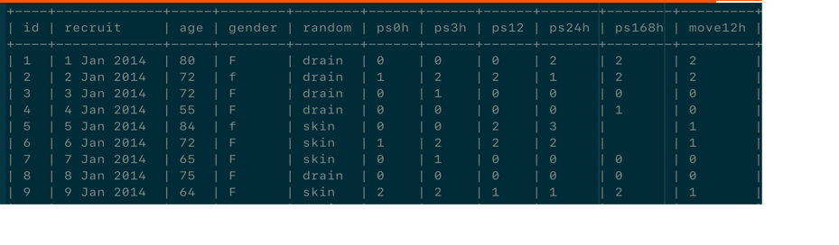
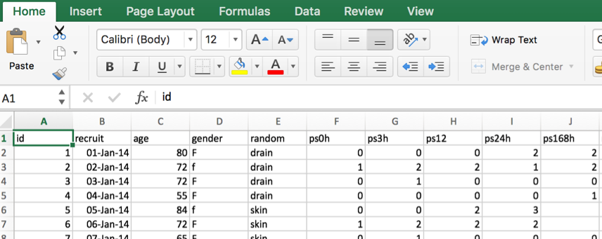
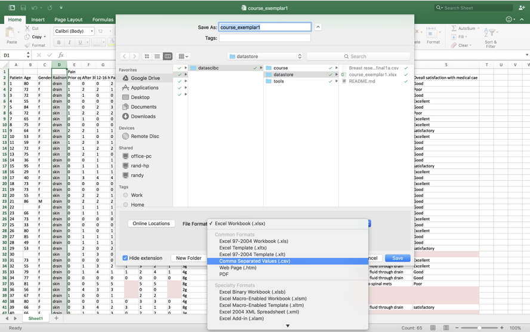
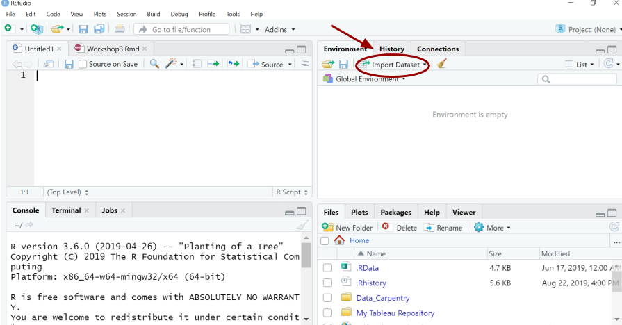
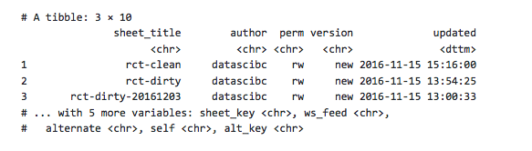
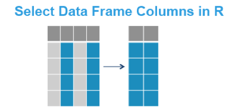
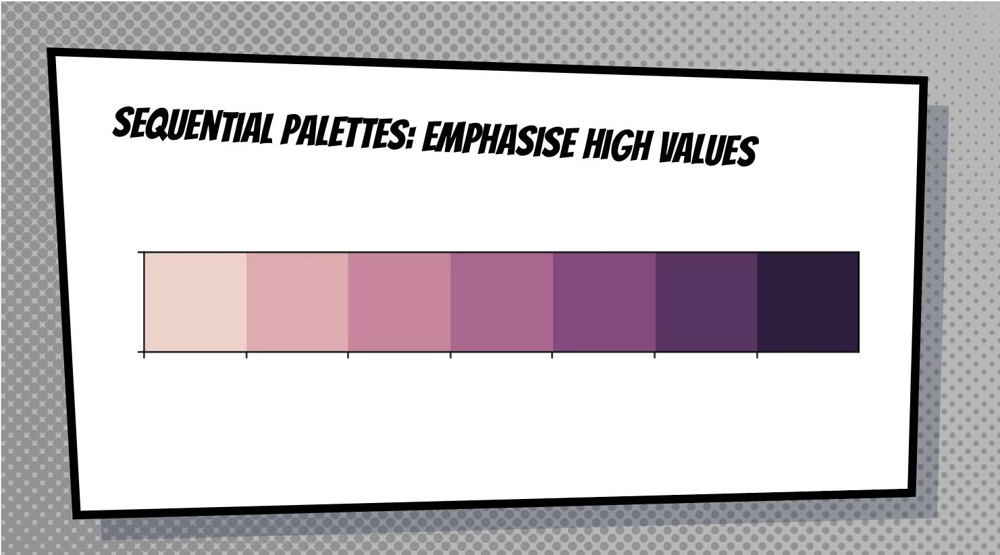
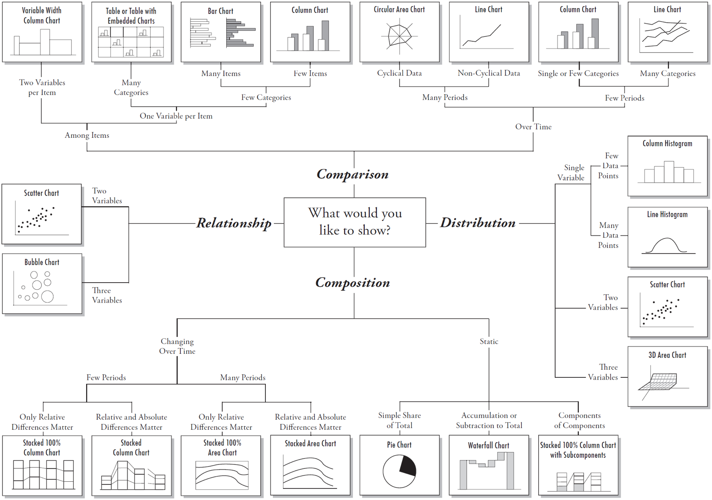
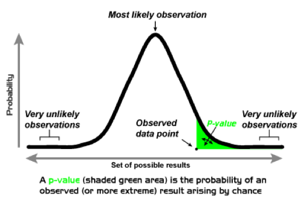
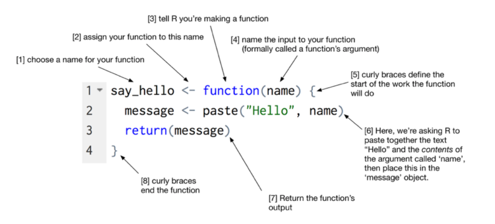

\newpage 

\tableofcontents 

```{r, include = FALSE}
# We will need this data later.
library(tidyverse)
cchic <- read_csv("clean_CCHIC.csv")
```

# Licensing
This course is licensed under a Creative Commons share-alike licence. 
[Creative Commons](https://creativecommons.org/licenses/by-sa/4.0/)

The course has been adapted from the Data Science for Doctors course.
[DS4D](http://datascibc.org)

\newpage

# Workshop 1 - Introduction to R.

## Introduction

### What is R?

R is a FREE and open source software for statistical computing and graphics. It works with variety of platforms:  

- UNIX
- MacOS
- Windows

R uses a computer ‘language’ that is thought to make it particularly suitable for statistics. Often the challenge new users face is learning that language. Most people are often used to a graphical user interface (GUI) where they can point and click. With R, you need to describe to the computer the steps you want it to take. 

It does get better with practice!

But why bother with the practice for R? You are not limited to pre-designed command process of a particular GUI package – you can give R your data and ask it to work through almost any calculation or process.

### Reproducible science

One of the main criticisms of data science may be that logging the steps of your analysis can be arduous or contain errors, so if a third party were to try and reproduce your findings they may well get different results. Also, how many times have you been working with a large database and found that there was either an error in the data or you made an error early on in your workings. You have then had to go back and re do the whole analysis from the point at which you made an error.

With R:

-	The code you write to analyse your data is also the record of your analysis.
-	If you make a mistake early on, this can be corrected and the subsequent code still valid and likely adaptable. 
-	You can use the similar analytical methods on a whole other database, by saving and re-using code. 

\newpage

### R Studio 

This is what the R studio interface looks like:

<p>

</p>

The windows (clockwise from bottom right) are:


*Console*
When you type in the "Console", you are typing into R itself. Commands are executed, but not saved.
Here `Enter` executes a command


*Source*
This is a text file. You can type commands in it, and send them to the "Console", where they are executed in R. You can save the text file on your computer so that you have a record of the commands you run.
Here `Cmd + Enter` (Mac) or `Ctrl + Enter` (Windows) executes your command. 


*Environment*
This lists the objects you are working with in your R environment.


*Supporting Panes*
The supporting panes include: 

 -	Help pages
 -	Plot outputs
 -	Browser for your files (this is your computer, if you delete something here it will also be deleted from your computer drive. BE CAREFUL)

\newpage

## R building blocks

We propose that there are three main building blocks to R:

1.	Names
2.	Data
3.	Functions

### 1. Names

Names are assigned to a value/function/file. 

The assignment operator is `<-`.

You can then recall the value/function/file by using the name

```{r}
# Assign the value of 2+2+6 to the name `practice`. Notice there is no output in the
# console, but 'practice' is added to the environment window.
practice <- 2 + 2 + 6
# Recall the value using the name.
practice
```

You can also assign names to text, but note that the text needs to be surrounded with "". Also note that object names can't have spaces in them.

```{r}
say_hello <- "hello"
say_hello
```


### 2. Data

R is a statistical computing language; statistics uses vectors and matrices. 

#### *Vector*

A vector is a structure containing elements of the same type of data.

* Collection of numbers (integer vector). Example - age.
```{r, echo = FALSE}
c(50, 25, 32, 67, 46, 19, 48)
```
* Collection of real numbers (numeric vector). Example - temperature
```{r}
c(37.5, 37.1, 37.3, 38.3, 37.4, 38.9)
```
* Collection of characters (character vector). Example - name.
```{r, echo = FALSE}
c("Adam", "Sally", "Eve", "John", "James", "Jennifer")
```
* Collection of true/false values (logical vector). Example - 'blood results avaiblable?'
```{r, echo = FALSE}
c(TRUE, FALSE, FALSE, TRUE, TRUE)
```

\newpage

You can also assign names to vectors. You need to use `c()` in order to combine the elements of the vector. Remember, characters need to be surrounded with `""`. 

```{r}
age <- c(50, 25, 32, 67, 46, 19)
# Recall the whole vector using the name.
age

# You can do the same thing for a character vector.
name <- c("Adam", "Sally", "Eve", "John", "James", "Jennifer")
name

gender <- c("male", "female", "female", "male", "male", "female")
```

You can recall specific elements of a vector using the name and `[]`.

```{r}
# The age of the second person.
age[2]
# The name of the fifth person.
name[5]
```

#### *Vectors – Other properties.*

If you add a `character` to a vector of integers, R will change the whole vector to a character vector.

```{r}
test <- c(1, 2, 3, 4)
# Note that `test` is a numeric vector.
str(test)
# Add a character to `test`
test <- c(1, 2, 3, 4, "x")
# Note that `test` is now a character vector.
str(test)
```

If you add a `logical` to an integer vector, `TRUE` is converted to 1 and `FALSE` is converted to 0. The vector remains numeric.

```{r}
test2 <- c(1, 2, 3, 4, TRUE)
# Note that the last element is `1`.
test2
# Note that the vector is numeric.
str(test2)
```

\newpage

#### *Matrix*

A matrix is collection of elements of the same data type, arranged into rows and columns. 
```{r, echo = FALSE}
matrix(1:9, nrow = 3, ncol = 3)
```

#### *Data Frame*

A data frame is just a list of vectors. We are all familiar with data frames, as a properly formatted spreadsheet is a data frame. Here is an example:

```{r, echo = FALSE}
data.frame(name, age, gender)
```

In the table above there are two character vectors and one numeric vector. 

You can create a data frame in R with the command `data.frame()`. R arranges the vectors as names across columns, and also numbers each row automatically. 

```{r}
# Combining the vectors we created before into a data frame.
patients <- data.frame(name, age, gender)
patients
```

Remember, if you try and create a data frame with unequal number of values in each vector R will try and fill in the missing values by filling them in for you. 

```{r}
name <- name <- c("Adam", "Sally", "Eve", "John", "James", "Jennifer")
gender <- c("male", "female")
# You probably don't want this to happen.
data.frame(name, gender)
```

You can review a specific vector in a data frame using `$`. 
Try `patients$age`.

\newpage 

### 3.	Functions

Finally, functions. 

Think of functions as factories. Each factory is designed to have a certain output and needs a specific input. A function may conduct more than one step on the data you input e.g. `table()` counts values and presents them by the group parameter you set (we will use `table()` later).

Functions will try and process most of the arguments you give it but there will be constraints. The help pages for the functions (accessed with either `?function_name` or `??function_name`) will detail these constraints. 

Examples of some functions which are useful for exploring your dataset are:

- `head(dataset_name)` - prints the first 6 rows.
- `tail(dataset_name)` - prints the last 6 rows.
- `summary()` - gives you infomration about either a data frame or a vector.
- `mean()` - calculates the mean of a numeric vector.

R has many inbuilt functions. Packages are repositories of functions separate to this inbuilt content. To access these packages from the online package repository, you need the commands:

`install.packages("package.name")`

`library(package.name)`

You only need to use the `install.packages()` command once. You will need to use `library()` to reload repositories you want to use each time you restart R. 

## R vocabulary.

The main terms to be get you started are:

* Names
* Vectors
* Data Frames
* Functions
* Packages 


#### R Studio cheat sheet

Available here:
https://www.rstudio.com/wp-content/uploads/2016/01/rstudio-IDE-cheatsheet.pdf

\newpage

# Workshop 2 - Keeping a clean dataset.

## Introduction

Spreadsheets offer a simple and effective method to collect data. However, their ease of use often leads to a sloppy approach to data entry. 
Good data discipline is an essential foundation to data analysis, and a small investment at this stage can prevent you running into trouble when trying to analyse and publish your study. This tutorial will take you through the essential dos and don’ts of managing your data in a spreadsheet.
As a word of caution, do not forget, that any data collection should be in line with the [Data Protection Act](legislation.gov.uk) and the [General Data Protection Regulation](ico.org.uk). Please ensure you manage your data appropriately.

This is a good opportunity to use the tutorial and compare the points below to your own original data. Take the time to clean your data as you read through the document. We have provided a ‘dirty’ sample of the Critical Care Health Informatics Collaborative (CC-HIC) public dataset to practice cleaning if you would prefer (see slack channel).
Prior to using any of the CC-HIC extracts please ensure you have signed the End User Licence Agreement (EULA).

### Spreadsheet applications
There are many different spreadsheets to use. Almost everyone will be familiar with Excel, although it is worth considering if this is actually the right choice for you. 
If you are planning a major collaboration, where many people need to enter data simultaneously, then an excel spreadsheet is probably not for you. Have a look at googlesheets as an alternative. As your requirements grow, you may want to explore a relational database. For now, we will assume you are using excel.

\newpage

## Data Types
To know how to best record and manage data, it is important to have an understanding of the type of data you are working with. 
Have a look at this diagram from derangedphysiology.com.

<p>

<p>

R supports all these data types. Look at the diagram below and consider how you may represent these data types in R.

If you intend to collect data on a spreadsheet program (e.g. excel), then import into R for further analysis, it is helpful to understand how R 'sees' data and what it is able to do with different types of data.

\newpage 

### Data types in R

#### *Integers and Decimals*

The values recorded in numeric variables can be viewed as either integers or decimals.
	
- Integers are discrete whole numbers (counting numbers) e.g. 1, 2, 3
    - You can specify an integer in R by writing an “L” after the integer e.g. 1L, 2L, 3L. This might seem strange, but it guarantees that the value you are recording is an integer, and not a decimal.
- Decimals are numbers that appear in the real world e.g. 2.1, 2.0, 1.9
    - Decimals are often called floats or reals in computer science
    - R refers to decimals as numerics

Computers apply maths differently to these two numerical data types.

#### *Factors*

The values recorded in categorical variables can be either nominal (unordered names) or ordinal (ordered names). R stores both these variables as nominal and ordinal factors respectively. 

Example of a nominal factor vector:

-	Apples
-	Oranges
-	Pears

R will store this as:

1.	Apples
2.	Oranges
3.	Pears

The numbers here do not indicate a relationship between the items. It is only used for indexing the list. R will not understand this as 1 > 2 > 3, which makes no sense in this context.

Example of an ordinal factor vector:

-	strongly disagree
-	disagree
-	neither agree/disagree
-	agree
-	strongly agree

This may be familiar to you as the Likert scale. Here the values are named, but there is an intrinsic order that may be relevant. Where there is an order to the values R stores the data as follows:

1.	strongly disagree
2.	disagree
3.	neither agree/disagree
4.	agree
5.	strongly agree

For ordinal factors, R understands that 1 < 2 < 3 < 4 < 5

\newpage

#### *Strings*

A string is any sequence of characters. Literally anything you can type can be represented as a string. This is the default data type in excel, and is what data typically defaults to if there is any confusion about what the data is. This is because anything can be represented as a string.
Take the example of recording the fluid balance of patients on the day of admission to ITU. If we write "480ml" excel will store this value as a string. It has no choice, since the "ml" adds data that cannot possibly be interpreted numerically.
When dealing with data that is numerical in nature, it is best practice to keep all units elsewhere and keep the data as an integer or decimal.


#### *Dates and Times*

Dates and times are a special case of integers and decimals. Computers store date information as integers being counted from a specific point in time. This isn’t helpful for us, as we have no idea how many seconds there are since 1st January 1970. R stores the integer value, and presents this as a formatted date when we ask for the value.

You will be using an extract from the CC-HIC in the next few workshops. You will note that all the patients are admitted on 1st January 2000. This was one of the measures to protect patient identification. Thus events (e.g. discharge dates, death dates etc.) are recorded as respective to 1st January 2000. 

The time is stored as a fraction of the date, but 10467.5674 is not intuitive to read. R will format this correctly when asked to present the data.

Depending on the cell format, typing the same date in excel will give you different appearances, or even a different actual date. 
<p>

<p>

#### *Booleans*

These are binary statements, i.e. TRUE or FALSE, which are recorded by the computer as 1 or 0 respectively.
Of note, FALSE is always 0. TRUE can be stored as any non-zero number. When recording TRUE or FALSE statements for any variable (e.g. on antibiotics, had steroids etc.), it is best to stick to this single conventional practice.

\newpage

## Formatting

#### What is a CSV file?

A comma separated values file is as it says on the tin! The structure of columns and rows stays the same but data values on a single row are separated by commas instead of walls of a cell.
Here is what a CSV file looks like if you were to look at the data raw:


Here is what you see when you open up your CSV file in a spreadsheet application:



Excel opens it up to view as above but also has formatting which makes it easier to read, and an interface where we can interact with the program to manipulate the data.



\newpage

#### What to do about formatting?

It is often easier for files to be converted into CSV before importing into R. This ensures that the data is being 'translated' into a universal structure that both applications can understand. Therefore, coloured cells and font formatting will not be translated when converted to CSV. 
Remove all coloured cells and formatting from the data you are using for this workshop.

### Common Mistakes to Avoid and Correct
The following are a list of common mistakes to avoid. See if you can find examples in your data and correct as you go along:

- Multiple tables
    - Multiple tables in one sheet will confuse the computer
    - The computer will still identify each row as a different single identity across multiple tables
    - Using the same field name twice - this will confuse the computer. 
    \newline
- Multiple tabs
    - E.g. a different tab for each day of your wet lab experiment
    - Recording across different tabs means you may make mistakes or have inconsistencies in your recording
    - When you come to merge all the tabs together make sure to change the headings.
    - Multiple tabs can be avoided by accepting that your data sheet is going to be potentially quite large.
    - If you must use multiple tabs, consider before creating each one whether the information could be recorded on the single sheet.
    - You do not have to merge the multiple tabs made available in the CC-HIC dirty extract. Just have a look and think how you would do so.
    \newline
- Repeating headers
    - Never ever do this. You will not be able to run calculations on these variables as the computer won’t know which column you are referring to. 
    - In order to scroll across headers and columns, you can freeze them. 
    - Freezing rows and columns, view > freeze top row
    \newline
- Not filling in zeros
    - If a value of a recording actually is ‘zero’, record that ‘0’ e.g. number of infections during admission on ITU.
    - If there is no value in the cell (even if the value was counted but nothing observed) the computer will interpret that as missing
    \newline
- Using bad null values
    - Essentially, don’t use numerical values (‘9999’ or ‘0’)
    - Blank or NA are reasonable choices
    \newline
- Using formatting to convey information/make the sheet look pretty
    - The formatting (e.g. coloured cells) won’t be conveyed in R, try and change this to another column that gives you this information without the need for formatting. 
    - Merging cells, including for headings, compromises your computer’s ability to read your data. Always avoid merging, consider instead adding pre/suffix to each heading.
    
\newpage
    
- Using punctuation or units inside cells
    - Leaving units or comments may be a helpful aide memoire at the time but will confuse your data analysis process. 
    - Create another variable/column
    \newline
- More than one piece of information in a cell
    - E.g. BP 120/80, 90/60
    - Separate this out into 2 columns; DBP, SBP
    \newline
- Special characters in data
    - E.g. tabs for format lines of data
    - Importing this in R could result in a line being cut in half/lost data/extra rows
    \newline
- Inclusion of metadata in data table
    - It’s natural, and good practice, to store information about your data 
    - But, it doesn’t (and shouldn’t) be on the same sheet, as this can disrupt how the computer will interpret the data. 
    - Store this in a different file. 
  \newline
- Field name problems
    - Avoid spaces and special characters
    - R doesn’t like spaces
    - Some programs don’t like text string names that start with a number
    - Generally consider using snake_case (this_is_snake_case) or CamelCase (ThisIsCamelCase) for all headers for consistency
    - Avoid uncommon abbreviations – you never know how long you may use this data for and keep referring to it or who you may need to share it with.

<p>


<p>

\newpage

## Recording and Cleaning Data


### Tips for recording data

1.	Keep three sheets/tabs in a file:
    - Sheet 1: This is your data
    - Sheet 2: Dictionary – you can define the terms for each of the variables. It is good practice to define each variable as what may seem obvious now, may not in 6,12,18 months etc..
    - Sheet 3: readme – a file for string where you can record further information 
    - Metadata goes in a different file.
    \newline
2.	Put all your variables in columns - the thing you’re measuring, like ‘weight’, ‘temperature’ or ‘SBP’. Break things down into their most basic constituents, and keep units in your headers only.
\newline
3.	Put each observation in its own row. Think very carefully about what constitutes your basic observation. Often it’s your patient, but it may not be as intuitive as you think.
    - e.g. for labour ward projects each row could indicate a delivery or a procedure and not necessarily a patient.
    \newline
4.	Don’t combine multiple pieces of information in one cell.
\newline
5.	Leave the raw data raw - don’t mess with it! That means no formulas anywhere in your spreadsheet!
\newline
6.	Dates and Times:
    - Absolutely separate out dates and times 
    - To make life very easy you can consider separate columns for: day, month, year.
    - This is definitely more intensive at the beginning but saves you time later on in the analysis.
    \newline
7.	True/False, Yes/No (Boolean or Binary) statements, where there are only 2 possible ‘answers’ to the variable in question (e.g. ‘severe CVS disease’ – ‘did the patient have known  severe CVS disease when admitted?’):
    - Best to record as 1 and 0
    - You can of course just record TRUE and FALSE, but if typing in the answers 1 and 0 are quicker.
    \newline
8.	Export the cleaned data to a text based format like CSV. This ensures that anyone can use the data, and is the format required by most data repositories.

\newpage

### Tips for cleaning data

1.	Understand what each row and column is meant to be recording:
    - Is each row a patient, or a patient event?
    - Does each column record a data point that applies to each patient 
    - If a column contains information about other columns (and not specifically about the row unit) this is called metadata (data about data). 
    \newline
2.	Understand the types of data being recorded in your spreadsheet 
    - Assess each column, does it contain:
       - Integers
       - Decimals
      - Categorical: Nominal/Ordinal
      - Boolean
      - Dates
      - Times
      - (Dates and Times)
      - Strings
    - Ensure for each of the data you have identified, that your spreadsheet application has formatted for that column correctly. 
       - E.g. numbers can be stored as string. They don’t look any different. BUT when imported into R, mathematical calculations aren’t possible as R does not see them as numbers. 
       - Formatting in the spreadsheet is mostly straightforward with dropdown options. Just beware when formatting dates/times to ensure no major changes. 
       \newline
3.	Go through each variable/column:
    -	Review headers; rename duplicates, remove spaces
    -	Decide how you are going to record your missing values, ‘NA’ is a good option. 
    -	Ensure that you aren’t recording a single thing more than one way, e.g. ‘F’ and ‘f’ for female. Pick one and ensure all females are recorded the same way. 
    -	Remove units, you can create a different column to hold units if needed, though it is best to just convert all values to a common unit
    -	Put ‘0’s where they are meant to be
    -	Remove punctuation/formatting
    \newline
4.	Remove “extra headers” – combine these into variable names
    \newline
5.	Remove colour formatting
    \newline
6.	Merge tabs if possible – then all you data can exist on one data frame 
    \newline
7.	Remove columns containing calculations. 
    - You can either change these to “values only” if you still really need the data
    - OR remove completely keeping only raw data, knowing you are going to be creating calculations in R. 

\newpage

# Workshop 3 - Importing Data into R

## Introduction

### Reproducibility

We strongly believe that the greatest strength you will gain from the work today is reproducibility. Learning coding is a pain, and for a 'one off' process there will nearly always be some tempting point-and-click alternative. However, learning to code, means being forced to write down what you did to get from your data to your result. You'll only have to reproduce something once to appreciate the value of having everything documented. Whether it is an error in your data, a new observation, or your supervisor or collaborator asking you to repeat an analysis with a twist, you will always be revisiting and revising your work. And the initial investment in writing (i.e. coding) your analysis means that these adjustments become simple. 

#### What you will learn

What are files and directories?  
Importing spreadsheet data into R  
Initial exploration of your data  
Tips on using Google sheets with R

## Files and Directories

Directories are folders, they contain other folders and files. 

Their relevance will become obvious once we need to instruct R, using code, where to find our stored databases. Therefore we will touch on this again later with greater detail. 

\newpage

## Importing Your Data into R

There are three main methods for getting data into R:  

1. Point and click  

2. Using commands  

      - Better for reproducibility
      
      - Someone else would just have to replace the source code to run the code on their own computer  
      
3. Connecting to an online database like google spreadsheet  
    - But first you need to save your data in a format that can be understood by R. 

#### Saving your data as a CSV file

We need a 'common data language' that all spreadsheet languages can write to, and all statistical and programming languages can read. Arguably, one of the oldest and most ubiquitous is the 'comma separated values' (CSV) file. This is easily exportable from Microsoft Excel, Apple Numbers, Open Office, Google Sheets...etc.  

It's a simple format. The top line are the column names, each separated by a comma. The following lines are the observations in those columns, again, separated by a comma.   

Its strength is in its simplicity. It only has data, no formulas, no tricks and is very well recognised amongst software packages as it is very easily supported. R has excellent support for CSV files.

<p>

<p>

\newpage
Spreadsheet programs allow you to save your data in a .csv format.
<p>

<p>

\newpage

### Point and Click

You can either use   
  1. `Import Dataset` tab in the `Environment` pane  
OR
  2. Navigate with the `Files` tab in the `Supporting Pane`  
  
**The point and click method is not reproducible**  

<p>

<p>

\newpage

### Importing Data with Commands

##### Finding and setting your working directory

To use commands for importing data you need to instruct R where to find your database file (this is where directories come in).  
- R would have chosen a working directory for you. You can check what it is using the `getwd()` command.

```{r, eval=FALSE}
getwd()
```

You can set your working directory to be the location of your file.

```{r, eval=FALSE}
setwd()
```

<p>

<p>

\newpage

Remember

- You need quotation marks (`""`) around your file path name
- Start with a root directory and then specify branches 
- If you have a file in the directory you wish to use, you can find out the file path name by right clicking on the file:
  - `Properties` in Windows
  - `Get Info` in Mac
<p>

<p>

Note - Folders within directories are specified with:  
  - `/` in Mac   
  - `\\` in Windows  
However, the correct notation in R for both is `/`

\newpage

##### The `readr` package

- `readr` is a package containing functions to help R read your external files  
- It is automatically installed with `tidyverse`  
- Install and load the package as follows  
```{r, eval=FALSE}
install.packages("tidyverse")
library(tidyverse)
```

##### You are now ready to import the file.

You can then tell R to read a CSV file by specifying the full file path name. You can see an example of this below, but the path will be unique to your computer. 

```{r, eval=FALSE}
cchic <- read_csv("clean_CCHIC.csv")
```

Now look for the `tibble` in your console.

You have now imported the files into your R environment. How can you look at the contents of the dataset within R?

```{r, eval=FALSE}
# Looking at the file in R
View(cchic)
```

This gives you a neater view, which is more human legible than the output printed in the console.

<p>

<p>

##### Shortcuts

- There are notations to shorten the code for the file path.
- Use a single dot for a file within the current working directory.

```{r, eval=FALSE}
read_csv("./clean_CCHIC.csv")
```

- Use a double dot `..` for a file  within the directory above the currnet working directory.

\newpage

## Reviewing Your Data in R

Spreadsheets in R are called data frames.  
You can get to know your data frame with the following functions:  

  - `head(cchic)`  
  - `tail(cchic)`  
  - `names(cchic)`  
  - `str(cchic)`  

```{r}
head(cchic)
```

- Gives you the first 6 rows and 12 columns as a tibble
- Lists other column headings at the bottom
- Useful to see if there are two column heading rows


```{r}
tail(cchic)
```

- Like `head()` but gives you the last 6 rows as a tibble
- Useful to look for missing data at the end of the dataset

\newpage

```{r}
names(cchic)
```

- Lists the names of all the variables
- Useful if you want to check for the spelling of any variables

```{r}
str(cchic)
```

- Reports the format of each variable in R.
- You can therefore check vectors before running functions. This would prevent you, for example, from trying to run a mean on a string vector

#### Co-ordinates

You can also use code in the form of coordinates to help you look at specific items within your `data frame`.  

  - For example:
```{r}
cchic[25, 5]
```

This is the value of the 5th variable on row 25.

#### $ to review column

You can extract a specific variable using `$`.

  - Enter the `data_frame_name$variable_name`
  - For example
  
```{r}
cchic$weight
```

This lists all of the data in the weight variable.

### Description Functions

Some packages contain functions that help describe the whole data frame. These normally describe the type of each variable, and may include summary statistics such as the mean, or the range of data values. 

Examples include:
  - `Desc()` from `DescTools` package.
      - This function also outputs plots for each variable.
  - `Describe()` from `Hmisc` package. 
  
To use these you have to install the appropriate packages

\newpage

## Exercises

1. What are the variable formats in `cchic`?
2. Display the `discharge` vector in `cchic`.
3. How many men and women are in the database?
4. How many survived and how many died?
5. What does the function `ls()` do?
    - Use it to see how many vectors contain information about "temp"
    
\newpage  

### Solutions

1. What types of variables do you have in the `cchic` data frame?
```{r, eval = FALSE}
str(cchic)
```

2. Display the `discharge` vector from `cchic`
```{r}
cchic$discharge
```

3. How many men and women are in the database?
```{r}
table(cchic$sex)
```

4. How many survived and how many died?
```{r}
table(cchic$vital_status)
```

5. What does the function `ls()` do?
```{r}
ls(cchic, pattern = "temp")
```

It lists all variable names with the word `temp` in them.
    
\newpage

## Addendum: Importing from Google Sheets

Googlesheets are spreadsheets which allow for collaboration and live-updating.

It is possible to load and use the data in a googlesheet in R. For this you need the `googlesheets` package. 

```{r, eval=FALSE}
install.packages("googlesheets")
library(googlesheets)
```

Then you can have a look at the files in your google sheets account with the function `gs_ls()`.  
You will see a tibble of the list of files, here is an example of what that can look like:

<p>

<p>

- The first time you run this you will be asked to authenticate. 
- A new browser will open and you will be asked to sing-in to your google account
- A code will then be displayed, which you will have to input into your console.
- Behind the scenes, R now saves a hidden file into your working directory.
- The next time you run your script, as long as you haven't moved your code to a new directory, it won't need to ask for authentication again.

Then, as before, use `read` commands in R to import your data as a tibble.

```{r, eval=FALSE}
file_name <- gs_title("googlesheet_title")
data_frame_name <- gs_read("file_name")
```

\newpage

# Workshop 4 - Data Wrangling.

## Introduction

### What is Data Wrangling?

The term data wrangling describes the process of transforming your raw data into other formats, which can then be used for analysis. Analysis can include summary counts, plots and statistical tests. 

Data Wrangling includes:

-	Cleaning Data
-	Unifying complex and messy data 
-	Converting one form of raw data into other variables

Data wrangling is a step in the data pipeline. The term data pipeline refers to the processes your raw data is subjected to in order for you to reach your end output with your data (this could be a presentation, a journal article, a report etc). 

<p>


<p>

### Data wrangling with dplyr

You do not need the dplyr package to wrangle your data but it uses intuitive grammar that simplifies data wrangling/manipulation. 

```{r, eval = FALSE}
# You only need to do this once
install.packages("dplyr")
```
```{r}
# You need to do this each time you open R
library(dplyr)
```

The main concept in dplyr, is of piping your data with the code `%>%`. ‘Piping’ here refers to taking the object to left of the code and applying more commands to it. This is not the same as the term data pipeline. 

With the pipe function, `%>%`, you can essentially do the following:

`data_frame_name %>% [select certain patients/rows] %>% [function]`

The keyboard shortcuts for the pipe are:
- `Cmd + Shift + M` (Mac) 
- `Ctrl + Shift + M` (Windows)

## Common dplyr functions

- `filter()`
- `select()`
- `group_by()`
-	`summarise()`

\newpage

### Filter

This functions allows you to select rows based on the criteria you specify.

<p>

<p>

```{r}
cchic %>%
  filter(age_years >= 65)
```

You can then create a whole other data frame to work with a subset of data:

```{r}
elder_cchic <- cchic %>%
  filter(age_years >= 65)
```

\newpage

### Select

This allows you to select only certain columns, that you can also use to create a separate data frame if you wanted. 

<p>

<p>

```{r}
cchic %>%
  select(sex)
```

This gives you just the variable named `sex` for all patients.

### Filter and select together

You can also use `filter()` and `select()` together but be careful about the order as you will not be able to `filter()` according to a variable if it has been inadvertently removed by a `select()` command.

```{r}
cchic %>%
  filter(age_years >= 65) %>%
  select(sex)
```

\newpage

### The `group by` and `summarise` functions.

`group_by()` breaks down a dataset into specified groups of rows. When you then apply operations on the resulting object they’ll be automatically applied “by group”. Most importantly, all this is achieved by using the same exact syntax you’d use with an ungrouped object.

You can use the `summarise()` function to apply a summary statistic to a vector. 

```{r}
cchic %>%
  group_by(sex) %>%
  summarise(mean_urea = mean(urea, na.rm = TRUE))
# Some summary statistic functions do not work with missing values, so you need to add the
# `is.na` argument to remove these.
```

### Using the pipe with other functions

Piped data can be piped on to be used in almost any function in R, for example:

```{r}
cchic %>%
  filter(is.na(age_years) == FALSE, age_years >= 65) %>%
  select(sex) %>%
  head()
```

Gives you the first 6 rows of the dataset of gender for patients older than 65. 

```{r}
cchic %>%
  filter(age_years >= 65) %>%
  select(sex) %>%
  is.na() %>%
  sum()
```

Counts missing values in gender for those above 65. Gender does not appear to have missing values for these patients.

\newpage

## Favourite Data Tidying ‘Recipes’

1.	Rename a variable
2.	Creating new columns
3.	Extract numbers
4.	Manipulate strings
5.	Manipulate dates
6.	Columns to rows and back again 
7.	Deleting variables.

### 1. Renaming a variable

You can do this with `rename()`.

The variable called `na` is very confusing, because missing values are represented as `NA` in R.

```{r}
cchic <- cchic %>%
  rename(sodium = na)
```

### 2.	Creating new columns

You can do this with the `mutate()` function. 

```{r}
cchic <- cchic %>%
  mutate(bmi = (weight / (height / 100)^2))
```

You have created the new variable `bmi`. You can also use the `mutate()` function to change the vector type of a column. 

```{r}
cchic <- cchic %>%
  mutate(gender = as.factor(sex))
```

### 3. Extracting numbers

You will need the `readr` package for this. The `parse_number()` function is useful when two different vector types have been recorded in the same column e.g. `37.2c` or `270mls`. 

(Parsing a value is essentially analysing a string or text into its components)

```{r, eval = FALSE}
install.packages("readr")
```
```{r, echo = TRUE, output = FALSE}
library(readr)
```

Let's look at the non-central temperature variable.

```{r}
str(cchic$temp_nc)
```
Notice that the variable is structured as a character, because the unit has been recorded with it. We should remove the unit.

```{r}
cchic$temp_nc <-
  parse_number(cchic$temp_nc)

head(cchic$temp_nc)
```

\newpage

### 4.	Manipulate strings

You will need the `stringr` library. 

```{r, eval = FALSE}
install.packages("stringr")
```
```{r, echo = TRUE, output = FALSE}
library(stringr)
```

```{r}
test_gender <- c("f", "F", "M", "f")
```

Notice that `female` is coded in 2 different ways  

We can change all of the letters to uppercase.
```{r}
test_gender <- str_to_upper(test_gender)
test_gender
```

You can also use the `str_to_lower()` function to change the letters to lowercase.

### 5. Manipulate dates

R treats dates as characters unless you tell it not to.
You can use the `lubridate` package to manipulate dates.

You can extract each of the components from a standard date vector (days, months, years). You will need the lubridate package.

```{r, eval = FALSE}
install.packages("lubridate")
```

```{r, echo = TRUE, output = FALSE, message=FALSE}
library(lubridate)
```

#### Converting characters to dates.

```{r}
test_dates <- c("02-01-12", "03-04-15", "15-06-02")
# Since the dates are in a date-month-year format, we use the dmy function.
test_dates <- dmy(test_dates)
test_dates
```

#### Extracting components of dates.
If the dates are in date format, we can extract components of dates. 

- Extracting years:
```{r}
cchic_year_born <- year(dmy(cchic$dob))
head(cchic_year_born)
```

- Extracting days.
```{r}
cchic_discharge_days <- day(dmy(cchic$discharge))
head(cchic_discharge_days)
```

\newpage

#### Date intervals

There may be times when you are interested in computing the difference between two dates e.g. length of stay (discharge date – admission date). There are two main ways to do this with lubridate, both of which will compute a time difference in days. 

- Quicker way - Calculate difference, telling R that both components are dates.

```{r}
cchic <-
  cchic %>%
  mutate(los = (dmy(discharge) - dmy(admission)))
# You have now added a new variable to your data frame and can recall it.
head(cchic$los)
```

- Alternatively - Converting both vectors to date form, then calculating difference. 

```{r}
cchic$discharge <- dmy(cchic$discharge)
cchic$admission <- dmy(cchic$admission)
cchic_los_test <- cchic$discharge - cchic$admission
# This time, we just saved the vector in a separate object - not the data frame.
```

### 6. Columns to rows.

You may want to do this to your data is you are interested in creating time series data from multiple columns into a single row. 

The conversion looks like this.
<p>

<p>

This is how you convert the data.

```{r}
library(tidyr)

cchic_long <- cchic %>%
  gather(
    "temp_point", "temperature",
    temp_c:temp_nc
  )
```

Look at the what the new variables contain.
\newpage

A major benefit of creating time series data is that it is easier to plot the data and visualise any trends.

Let's do a quick example - we will learn how to plot graphs later on.

```{r}
library(ggplot2)
cchic_long %>%
  ggplot(aes(
    x = temp_point, y =
      as.numeric(temperature)
  )) +
  geom_boxplot()
```

\newpage

### 7.	Deleting variables.

You can use the `select()` function here too, but with a `-` before the column name you want to remove. 

The `lactate` variable is mostly empty. Let's remove it. 

```{r}
cchic %>%
  select(-lactate)
```

Remember to tell R that you want to keep these changes to the dataframe.
```{r}
cchic <- cchic %>%
  select(-lactate)
```

\newpage

## Excercises

1. How many patients weigh more than 70kg?
    - Hint- look at the `n()` function. 

2. Outcome of patients who were 60 years or older?
    - What is the mean length of stay of patients who are 60 years or older?
    - How many of these patients were discharged alive?
    - Hint - the variable `vital_status` indicates if the patient was alive or dead on discharge.
    
### Solutions

1. How many patients weigh more than 70kg?
```{r, eval = FALSE}
cchic %>%
  filter(weight > 70) %>%
  summarise(number = n())
```


2. Outcome of patients who were 60 years or older.
```{r}
# Mean length of stay
cchic %>%
  filter(age_years >= 60) %>%
  summarise(los = mean(los))

# Number of people alive at discharge
cchic %>%
  filter(age_years >= 60) %>%
  select(vital_status) %>%
  table()
```

\newpage

# Workshop 5 - Visualising data

## Introduction

According to Edward Tufte, "excellence in statistical graphics consists of complex ideas communication with clarity, precision and efficiency". 

Plotting data allows you to:

1.	Explore the data
2.	Tell a story (convey a message)
3.	Use colour

### 1.	Exploring data

These graphs give you a good idea of how the data is distributed.

- Bar charts for discrete variables
- Histograms for continuous variables
    - Be mindful of the number of bins you choose; too many and you lose the ‘signal’ and too few and you can’t appreciate the ‘signal’.
    - Can also be used to approximate distributions
- Scatterplots can reveal outliers that may not be obvious from looking at the dataframe. 

### 2. Storytelling

-	Pie charts are not useful if you are demonstrating more than 2 categories. 
-	3D generally has no advantage over 2D

### 3.	Using colour 

-	Try and use colour mindfully (not just so things look pretty!)

Colour can be used to clarify/strengthen your message:





Also remember that gender and colour blindess can affect perceived intensity of colour.

- Men:
    -	Yellows/greens look simillar
-	8% suffer from red/green colour blindness

- Women:
    -	Blues look dark
    -	0.5% suffer from red/green colour blindness

\newpage

### ggplot2

ggplot2 is an R library that allows us to easily make publication quality plots. It is based on the "Grammar of Graphics" which describes a vocabulary for creating plots from data.

Just like you had to become familiar with the syntax for piping data with dplyr, ggplot has its own syntax. In general, you need to tell the function `ggplot()` what data to use and then how to present it (what geom). The term geom refers to the type of plot and needs to be given mapping aesthetics. Mapping aesthetics refer to the variables the `geom_function()` will use to create a specific plot. 

A ggplot command generally looks like this.

```{r, eval = FALSE}
ggplot(data = date_frame_name) +
  style_of_plot(mapping = aes(x = vector_name1, y = vector_name2))
```

You can also add arguments to the style of plot making the package very versatile for presenting data in lots of different ways. These include changing the size of features on the graph, or splitting the data into groups.

```{r, eval = FALSE}
ggplot(data = date_frame_name) +
  style_of_plot(mapping = aes(x = vector_name1, y = vector_name2) +
    other_arguments)
```
	
The syntax examples above are to help you grasp the arguments available for the `ggplot()` function. `ggplot()` also allows for flexibility in how to code for these arguments, as you will see below. You are still essentially telling R to do the same thing. Once you start to use `ggplot()` more you will develop your own personal preference on how you would like to code your `ggplot()` arguments. 

## Creating a scatter plot

We worked through exercises during the workshop, practicing different arguments for the `geom_point()` function. This essentially creates a dot plot for your data. 

```{r, echo = TRUE, output = FALSE}
library(ggplot2)
```

Load the `cchic` dataset and explore the variables you have. Ensure you have included the variable `los`, which you created in the last workshop.

```{r, fig.width= 5, fig.height=2}
ggplot(data = cchic) +
  geom_point(mapping = aes(x = age_years, y = los))
```

\newpage 

We can use a different colour based on whether the patient survived. We can also use shape and size of the point in the same way.

```{r, fig.width=5,fig.height=2}
ggplot(data = cchic) +
  geom_point(mapping = aes(x = age_years, y = los, color = vital_status))
```

You can also combine different aesthetics

```{r, fig.width=5, fig.height =2}
ggplot(data = cchic) +
  geom_point(mapping = aes(x = age_years, y = los, size = vital_status, shape = sex))
```

\newpage

Spot the difference in plot outputs with the following commands

```{r, fig.width=5, fig.height =2}
ggplot(data = cchic) +
  geom_point(mapping = aes(x = age_years, y = sodium), color = "blue")

ggplot(data = cchic) +
  geom_point(mapping = aes(x = age_years, y = sodium, color = "blue"))
```

Can you figure out why this happened? Look at the code and the help pages. Remember that syntax is important!

\newpage

You can split your graph up using facets.

```{r, fig.width=5, fig.height =2}
ggplot(data = cchic) +
  geom_point(mapping = aes(x = weight, y = los)) +
  facet_wrap(~sex, nrow = 2)
```

Look at this graph.
```{r, fig.width=5, fig.height =1.5}
ggplot(data = cchic) +
  geom_point(mapping = aes(x = age_years, y = los))
```

We should be able to see more data points in this graph. The problem is that a lot of the points are plotted on top of each other. We can use the `jitter` command to move the points a bit so that they are all visible.

```{r, fig.width=5, fig.height =1.5}
ggplot(data = cchic) +
  geom_point(mapping = aes(x = age_years, y = los), position = "jitter")
```

\newpage

## Creating a line graph

`geom_smooth()` allows you to create a line graph. We can also work through different examples of the arguments you can give `geom_smooth()` to help visualise your data. 

```{r, fig.width=5, fig.height =2}
ggplot(data = cchic) +
  geom_smooth(mapping = aes(x = sao2_abg, y = pao2_abg))
```

Using linetypes to convey differences

```{r, fig.width=5, fig.height =2}
ggplot(data = cchic) +
  geom_smooth(mapping = aes(x = sao2_abg, y = pao2_abg, linetype = sex))
```

\newpage

Combining multiple geoms in one chart

```{r, fig.width=5, fig.height =2}
ggplot(data = cchic) +
  geom_point(mapping = aes(x = sao2_abg, y = pao2_abg, colour = sex)) +
  geom_smooth(mapping = aes(x = sao2_abg, y = pao2_abg))
```


## Creating a bar chart.

Some plots allow you to visualise the raw data (such as the scatter plots above) but other geoms allow conduct a statistical transformation (e.g. counts, proportions) before presenting you the data. 

`geom_bar()` and `stat_count()` are both interchangeable, and both create bar charts. 

You can also change the labelling on the y-axis, so that you demonstrate proportion of all admissions in `cchic` and not just the raw count. 

```{r, fig.width=5, fig.height =2}
ggplot(data = cchic) +
  geom_bar(mapping = aes(x = care_level, y = ..prop.., group = 1))
```

Just like with plots that allowed you to visualise the raw data, you can also provide aesthetic arguments to bar charts and histograms to include a second vector. 

```{r, fig.width=5, fig.height =2}
ggplot(data = cchic) +
  geom_bar(mapping = aes(x = care_level, fill = sex))
```

What does this show? You can also use proportions to try and better visualise the relationship between these two vectors, this is done with the position argument. 

```{r, fig.width=5, fig.height =2}
ggplot(data = cchic) +
  geom_bar(mapping = aes(x = care_level, fill = sex), position = "fill")
```

The position argument can also be used to compare the two vectors as if combining two bar charts. 

```{r, fig.width=5, fig.height =2}
ggplot(data = cchic) +
  geom_bar(mapping = aes(x = care_level, fill = sex), position = "dodge")
```

\newpage 

## Cheat sheet.

Available here:

https://www.rstudio.com/wp-content/uploads/2015/03/ggplot2-cheatsheet.pdf

But also searchable with “ggplot cheat sheet”. Contains command prompts for more than 30 different types of data visualisation plots. It is also useful as a resource for inspiration on how to present your data. 

There are many different resources advising you on how to present your data (including the one below) but remember the important points above!



\newpage

# Workshop 6 - Basic Statistics

## Introduction

In general, research often seeks to answer a question about a large population (e.g. all of London, all of the UK) by collecting data on a small proportion (UCH ITU admissions, London hospital admissions). This means that many variables are collected for each member which leads to several thousands and sometimes millions of data points existing in a database. Presenting a whole database as part of an article is illogical and cumbersome. So, we can use R to not only conduct our descriptive statistics (summary statistics that describe the raw data) and inferential statistics (exploring relationships between variables e.g. gender and survival from ITU), but, the code we use is also a record of how we have manipulated the raw data (very handy for those pesky reviewer queries!). 

However, in order to know which descriptive and inferential methods to use on your data, it is important to understand the principles underlying the different types of data.

Notice – this workshop and handout is aimed at covering the basics to allow you to have a meaningful understanding of the code used in R. We will NOT be covering statistical theory in depth, nor discussing the formulas for the tests covered. 

## Types of data

Data can be:

- Continuous 
- Discrete
    - Nominal
    - Ordinal
    - Interval

### Continuous data

Examples of continuous variables are age, weight and height. 

These can be from numbers with 0 decimal points (d.p.) to an infinite number of d.p. (it is up to you to decide a sensible number). 

Data distributions (how the number of each value in distributed in the variable) can be described as known models of distributions (parametric), nor in a way that isn’t known (non-parametric). Plotting your continuous variables can help you decide what distribution it is. 
You can plot a histogram using `ggplot2` like this.

```{r, fig.height = 2, fig.width = 5}
ggplot(data = cchic, aes(x = age_years)) +
  geom_histogram()
```

\newpage

#### Normal distribution

There are tests of normality that can be conducted to check whether your variable is "normal", but is outside the remit of this workshop. Essentially some of the rules of a normal distribution are that:

-	Mean = mode = median
-	It is unimodal (has one peak)
-	It is symmetric (the distribution looks the same either side of that peak)
-	The extremes of the distribution are asymptotic (approach the x-axis)

<p>

<p>

#### Non-normal distribution

For simplicity continuous variables are said to have a non-parametric distribution if they do not meet all the above criteria. They can also include distributions which:
-	Are skewed (left, right)
-	Have more than one peak (e.g. bimodal)

<p>

<p>

\newpage

### Discrete data

Refers to data with categories:

-	Nominal 
-	Ordinal 
-	Interval

Nominal data refers to data types with distinct categories that have no order between these categories e.g. hair colour, type of antibiotic etc.

Ordinal data refers to data where there is an order to the categories e.g. level of ITU care where Level 1 < Level 2 < Level 3 in terms of intensity of resources. But, the difference between these categories is either not quantifiable OR equal e.g. Is the difference between Level 1 and 2 care the same as the difference between Level 2 and Level 3? (No). 

Interval data has both an order and the differences between the categories is equal e.g. time (the difference between 1 day and 2 days is the same as that between 3 days and 4 days).

## Describing Data

Why does it matter what type of data you are working with? Because it affects what summary statistics you use to describe them (and also analyse them with inferential methods). 

### Normally distributed data.

You might notice that the `height` variable in `cchic` appears to have a normal distribution. 

```{r, fig.height = 2, fig.width = 5}
ggplot(data = cchic, aes(x = height)) +
  geom_histogram()
```

The best way to describe normally distributed data is by reporting its mean and standard deviation. The mean (average) is essentially the sum of all values in a variable divided by the number of values. The standard deviation is a description of the spread of values in a variable (distributions may have similar means but very different spreads). 

```{r}
# Note that we remove missing values.
mean(cchic$height, na.rm = TRUE)
sd(cchic$height)
```

\newpage

#### More on standard deviation

To help convey the impact of difference in standard deviation we ran the following code for dummy distributions in the workshop. 

```{r, fig.height=2, fig.width = 5}
dummy_1 <- rnorm(1000, mean = 10, sd = 0.5)
# ggplot only accepts dataframes.
dummy_1 <- as.data.frame(dummy_1)
ggplot(dummy_1, aes(x = dummy_1)) +
  geom_histogram()
```

```{r, fig.height=2, fig.width=5}
dummy_2 <- rnorm(1000, mean = 10, sd = 20)
dummy_2 <- as.data.frame(dummy_2)
ggplot(dummy_2, aes(x = dummy_2)) +
  geom_histogram()
```

Do you notice the wider spread of data in the plot if data with the higher standard deviation?

\newpage

### Non-normal data

You may have noticed that the distribution for age_years in the `cchic` data is skewed; is it left or right skewed?

```{r, fig.height=3.5, fig.width=5}
ggplot(cchic, aes(x = age_years)) +
  geom_histogram()
```

It’s left! But either way the traditional way of describing this distribution is to report its median (very middle value, if there are two then the average of these) and the interquartile range (IQR, the difference between then 25th and 75th highest value in the distribution). 

```{r}
median(cchic$age_years)
IQR(cchic$age_years)
```

The IQR is, in a way, analogous to SD as it is also reporting spread of the distribution of data values in a variable. 

\newpage

### Describing Discrete/Categorical data

These can be described using frequencies, proportions or percentages. 

- Frequencies
```{r}
table(cchic$care_level)
```

-	Proportions
```{r}
care <- table(cchic$care_level)
prop.table(care)
```

-	Percentage
```{r}
prop.table(care) * 100
```

Note - `summary(data_frame_name)` will report the mean, median, standard deviation and IQR for all numeric variables in the specified data frame. 

\newpage

## Inferential statistics

Inferential statistics refer to tests which are used to compare distributions or values between two or more variables to see if there is a meaningful difference. 

Traditionally we use the p-value to communicate the probability of the observed, or more extreme result, arising by chance if both distributions were from the same population (i.e. no difference in populations). P-values < 0.05 are deemed significant, although we argue that p-value results 0.03 – 0.049 should be deemed as requiring further testing. 

<p>

<p>

Depending on your project you may be looking for either a statistically significant difference or not (e.g. a non-inferiority study).

<p>

<p>

In general, we like to advocate a meaningful analysis where you consider the following (prior to plugging in your numbers to a function that will attempt to spit out a result):
-	What is your hypothesis? Then, what is you alternate hypothesis
-	What type of variable (data type) do you have?
-	What are the assumptions of the test you are using? Do your data and your hypothesis meet these assumptions?

\newpage

### Comparing means

Let’s compare the height between men and women in the `cchic` database. (We already know that using `mean()` was the best way to describe height, as the distribution appears to be normal). 

```{r}
cchic %>%
  group_by(sex) %>%
  summarise(av.height = mean(height, na.rm = TRUE))
```

Let’s start with our hypothesis:

Null hypothesis
    - There is no difference in mean height between men and women
    
Alternate hypothesis
    - There is  a difference in mean height between men and women

The t-test is commonly used to compare the means of two different populations. There are two versions; paired and independent. 

The assumptions of a t-test are generally the following:

-	One independent categorical variable with 2 groups and One dependent continuous variable
-	The dependent variable is approximately normally distributed in each group
-	The observations are independent of each other
-	Independent: assumes equal variance in groups

Before looking at the code below, try conducting a t-test on differences in mean height between men and women, after looking at the help page with `?t.test`. Remember, to use any function your input data must fit the limits of the argument. 

```{r}
cchic <- cchic %>%
  mutate(gender = as.factor(sex))
cchic <- cchic %>%
  mutate(gender_num = as.numeric(gender))
str(cchic$gender_num)
t.test(cchic$height, cchic$gender_num)
```

\newpage

We have had to change the variable `sex`, which was a character vector, to a numeric vector. The arguments for the `t.test()` in R dictate that both vectors input must be numeric. 

We initially changed sex to a factor vector though, why do you think that was?

```{r}
sex_test <- as.numeric(cchic$sex)
```

What are the contents of the variable `sex_test`?

### Comparing counts

As we saw above we can create a table to describe discrete data. Here is one demonstrating frequency values for gender differences in survival.

```{r}
table(cchic$gender, cchic$vital_status)
```

To assess whether these differences are significant we, again, start with a hypothesis. 

Null hypothesis
    - There is no difference in survival between men and women 
    
Alternate hypothesis
    - There is  a difference in survival between men and women

The chi-squared test is often used for comparing counts and has the following assumptions:

1.	Data in cells should be frequencies or counts NOT percentages
2.	Levels/Categories are mutually exclusive – here being alive/dead applies
3.	Each subject contributes to one cell – can either be male/female and alive/dead
4.	Independent study groups
5.	2 categorical variables
6.	Values in each cell should be >5 (Otherwise the Fishers test is recommended)

```{r}
chisq.test(cchic$gender, cchic$vital_status)
```

Again, the function is R requires that it recognises both vectors used as numeric/factor, see `?chisq.test`. 

In general, it is a good idea to read the help pages of each new function as you start your R journey. This may seem tiresome but will get you used to the syntax of the help pages and help speed up your learning of new functions. 

\newpage

### Comparing non-normal or skewed distributions

Commonly this employs the use of the Wilcoxon Rank or Mann Whitney U test, which are both rank sum tests. In general, the use of non-parametric tests are recommended when any of the following apply:

- Level of measurement is nominal or ordinal
-	Unequal sample sizes
-	Skewed data
-	Unequal variance
-	Continuous data collapsed into small number of categories

We could compare length of stay (`los`) between men and women. 

First, we need to look at the distribution of the continuous variable, `los.` 
Does the distribution look approximately normal?

```{r, fig.height = 3, fig.width = 5}
ggplot(cchic, aes(x = los)) +
  geom_histogram()
```

We need to change lenth of stay to a numeric vector, to let us run tests using it. 

```{r}
cchic <- cchic %>%
  mutate(los = as.factor(los))

cchic <- cchic %>%
  mutate(los_num = as.numeric(los))
```

\newpage 

Let’s compute descriptive statistics.

```{r}
# Descriptive statistics for males
cchic %>%
  filter(sex == "M") %>%
  select(los_num) %>%
  summary()
```


```{r}
# Descriptive statistics for females.
cchic %>%
  filter(sex == "F") %>%
  select(los_num) %>%
  summary()
```

What do you notice?

#### Comparing the distributions

In order to compare these distributions, look up the help page for Mann.Whitney. Remember to use “??” if it is not recognised as a function of any of the current packages you have loaded. Also use Stack Overflow or your internet search engine if you are struggling.

You may have found that R uses the function `wilcox.test()` as part of the `Desctools` library to compare non parametric distributions. Read the help page for this and ensure that your input vectors meet the limits of the arguments for the function `wilcox.test()`.

```{r}
wilcox.test(cchic$los_num, cchic$gender_num)
```

\newpage

# Workshop 7 - Writing functions

## Introduction

Up to this point, we have been using functions written by others. We can also write our own functions to carry out operations we need to compute frequently.

<p>

<p>

## Write a function

Try writing this function for yourself. 

```{r}
say_hello <- function(name) {
  message <- paste("Hello", name)
  return(message)
}

say_hello("cheryl")
```

Use this function with your own name.

Let's try writing another function.

```{r}
BMI <- function(height, weight) {
  x <- weight / (height^2)
  return(x)
}
# Try calculating your own BMI
BMI(height = 1.60, weight = 60)
```

Now write a function to calculate your body surface area.

Where, BSA = $$\sqrt{(weight(kg)* height(cm))/3600}$$

Then test your function.

```{r}
BSA <- function(height, weight) {
  x <- sqrt((weight * height) / 3600)
  return(x)
}

BSA(height = 175, weight = 80)
```

