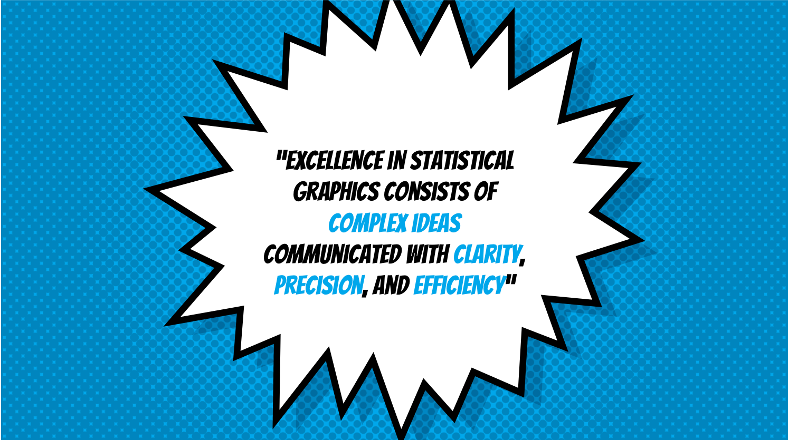
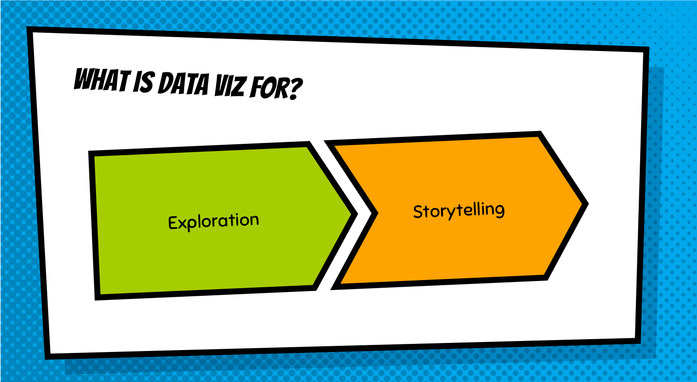
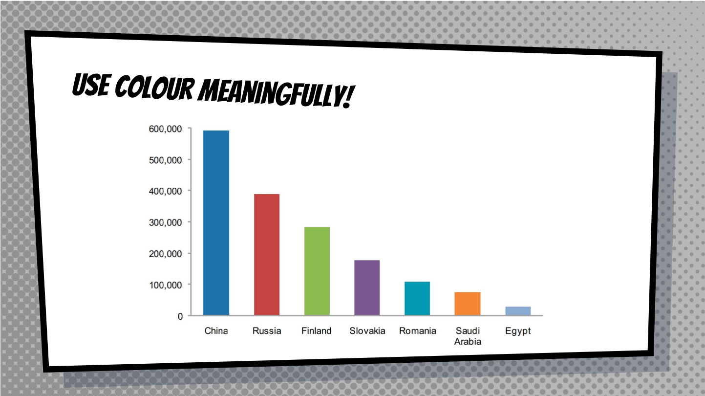
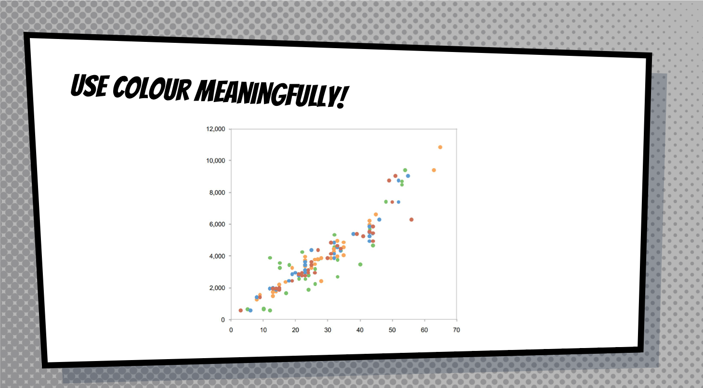
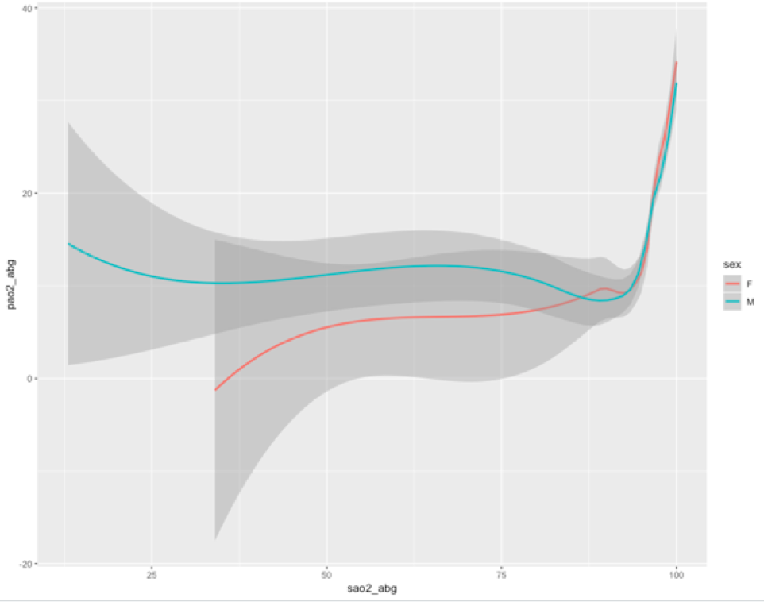
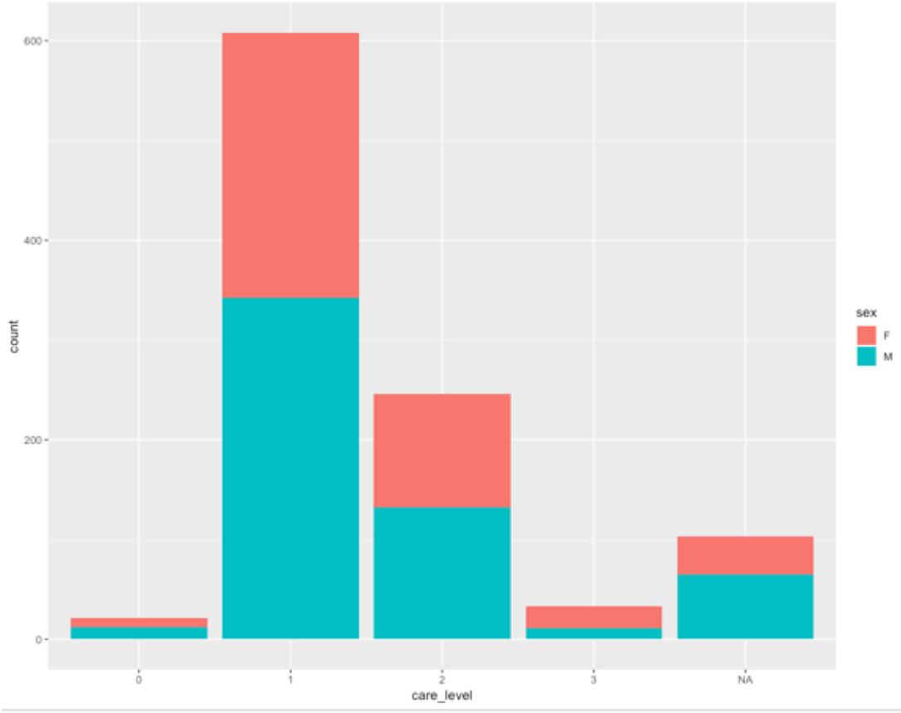

## Content

- General data visualisation tips
- Visualising Data in R with `ggplot2`

## 


::: notes
Say that the tips we are getting are from Edward Tufte. 
:::

## 


##



## 



## 


## 


## 


## 


## 


## 


## 


## 


## 


## 


## 


## 


## 


## 


## 



## 



## 


## 


## 


## 


## 


## 


::: notes
Say that though you can't see this images properly, this image is in the handout.
:::

## Visualising data in R

::: notes
We now get to draw graphs!
:::

## This book gives good instructions


## There are many ways to plot graphs in R

- Base R has visualisation commands

- `ggplot2` package which allows you to 'layer' features of graphs
    - this is what we will use
    - load it now
    - `library(ggplot2)`

## Structure of a ggplot command

It takes a while to get used to the structure.

There are different forms of syntax.

Different syntax possible

But in general:

```{r, eval = FALSE}
ggplot(data = date_frame_name) +
  style_of_plot(mapping = aes(x = vector_name1, y = vector_name2))
```

::: notes 
This will become more clear once we see examples
:::

## ggplot is very versatile

You can use the same structure for many types of graphs.

```{r, eval = FALSE}
ggplot(data = date_frame_name) +
        style_of_plot(mapping = aes(x = vector_name1, y = vector_name2)) +
  other arguments e.g. size of markers +
	further amendments e.g. splitting out into more than one plot based on group
```

## What is a 'geom'??

A `geom` is a visual aspect of a graph.

- dots
- lines
- bars

Look at the ggplot2 cheatsheet for more options.

## Create a dot plot

Open up the R script called `Workshop5.R`.
Run through the commands in it.
Notice how changing small parts of the main command change the appearance of the graph. 

Notice that we use `geom_point` for a dot plot. We will use other geoms later.

::: notes
There are a lot of commands in the file. Help them load up the file, get the dataset into their environment, and run the commands. Give them a little time to look at the different graphs.
:::

## Let's create a line graph together

```{r, eval = FALSE}
ggplot(data=  cchic) +
  geom_smooth(mapping = aes(x = sao2_abg, 	y = pao2_abg))
```

::: notes
Get them to type this code in and draw the graph. The graph they should get is on the next slide.
:::


## Adding a linetype

```{r, eval = FALSE}
ggplot (data = cchic) +
  geom_smooth(mapping = aes(x = sao2_abg, y = pao2_abg, linetype = sex))

```


## Adding colour 

```{r, eval = FALSE}
ggplot (data = cchic) +
  geom_smooth(mapping = aes(x = sao2_abg, y = pao2_abg, colour = sex))
```



## Combining multiple geoms

```{r, eval = FALSE}
ggplot (data = cchic) +
  geom_point(mapping = aes(x = sao2_abg, y = pao2_abg, colour = sex)) +
  geom_smooth(mapping = aes(x = sao2_abg, y = pao2_abg))
```


## Bar Graph


## Drawing a bar graph

- `geom_bar` and `stat_count` are interchangeable

```{r, eval = FALSE}
ggplot(data = cchic) +
geom_bar(mapping = aes(x = care_level))


ggplot(data = cchic) +
stat_count(mapping = aes(x = care_level))
```


## Proportion instead of count

```{r, eval = FALSE}
ggplot(data = cchic) +
geom_bar(mapping = aes(x=care_level, y = ..prop.., group = 1))
```


## Adding a second aesthetic

```{r, eval = FALSE}
ggplot(data = cchic) +
  geom_bar(mapping = aes(x=care_level, fill = sex))
```



## Standardising proportions

```{r, eval = FALSE}
ggplot(data= cchic) +
  geom_bar(mapping = aes(x=care_level, fill =sex), position = "fill")
```


## Changing position of bars

```{r, eval = FALSE}
ggplot(data= cchic) +
  geom_bar(mapping = aes(x = care_level, fill = sex), position = "fill")
```


# Create your own plots now!