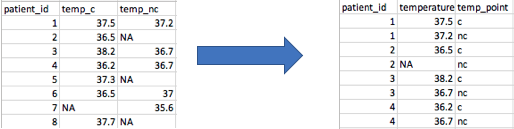

```{r, include = FALSE}
# We will need this data later. 
library(tidyverse)
library(lubridate)
cchic <- read_csv("../clean_CCHIC.csv")
cchic <- cchic %>% 
          mutate(los=(dmy(discharge)-
          dmy(admission)))
```

##


## Content

- Using the `dplyr` package.
- Standard methods for selecting data
- Recipies to perform common operations
    - Manipulating strings
    - Manipulating dates
    - Changing data structure

## What is data wrangling?

- Transforming raw data into a form you can use for analysis
- Includes
    - Cleaning data (Workshop 2)
    - Organising it into a structure that allows you to analyse it.
    - Creating derived variables from raw data
    - Validating the data

## Another way to think of it... 

- Taking raw data
- Subjecting it to processes along a data pipeline
- You can then use your processed data for analysis


## Load dplyr

```{r, eval=FALSE}
# You only need to install the package once.
install.packages("dplyr")

# You need to load the package each time you open R.
library(dplyr)
```

## Load data

Load data from the file you created earlier. The data frame should be called `cchic`

## The pipe 

:::::::::::::: {.columns}
::: {.column}
- Takes whatever you did before, and passes it on to the next function
- Whenever you see it, think of the word 'then' 
- `data_frame_name %>% 
  [select certain patients/rows] %>% 
  [function]`
- Shortcut - `Cmd + Shift + M` (Mac) `Ctrl + Shift + M` (Windows)
:::
::: {.column}

:::
::::::::::::::
::: notes
Tell them that there are a couple of things we need to cover about dplyr before we start working with it. This is the first one.
:::

## Logical operators

- You use them to compare values
    - `==`   (equal to)
    - `!=`   (not equal to)
    - `>, <`   (greater than, less than)
    - `>=, <=`   (greater than or equal to, less than or equal to)
    - `is.na()`   (is the value missing)

- More than one condition?
    - `&`   (and)
    - `|`   (or)

::: notes
This is the second thing we need to learn. It applies to most parts of R.
:::

## Example of using logical operators

- `age >= 18`
- `age >= 18 & age <= 60`

::: notes
For instance, when you are selecting something
:::

## Filter

Choose rows based on the conditions you specify.

```{r, eval = FALSE}
cchic %>%
  filter(age_years >= 65)
```

The output is a data frame where all patients are 65 years or older.

::: notes
Dplyr works using 'verbs'. The first one is `filter`.
:::

## Select

Allows you to choose specific variables from your dataset.

```{r, eval = FALSE}
cchic %>%
  select(sex)
```

Output is a data frame with the gender of all patients.

::: notes
The second verb is select.
:::

## Using filter and select together

```{r, eval = FALSE}
cchic %>%
  filter(age_years >= 65) %>%
  select(sex)
```

Output is the gender of patients who are 65 years or older.

What happens if you do `select()` and then `filter()`? 
You have removed the age variable from the dataset, so you can’t filter based on age.

## Piped data with functions

Piped data can be passed on to almost any function in R

```{r, eval = FALSE}
cchic %>%
  filter(age_years >= 65) %>%
  select(sex) %>%
  summary()
```

Gives information on gender for patients older than 65.


## Other dplyr wrangling verbs

- `filter()`
- `select()`
- `group_by()`
- `summarise()`


## Example of using group by and summarise

Try this.
```{r, eval = FALSE}
cchic %>%
  group_by(sex) %>%
  summarise(mean_urea = mean(urea))
```

What is the output?
Hint – check for missing values in `cchic$urea`

## Make it work

```{r}
cchic %>%
  group_by(sex) %>%
  summarise(mean_urea = mean(urea,
    na.rm =
      TRUE
  ))
```

An alternative is to filter out the missing values of urea.

## Take a break. Any questions?

Make sure you are happy running

- `filter()`
- `select()`
- `group_by()`
- `summarise()`

## Favourite data tidying 'recipies'

1. Rename a variable
2. Create a new variable
3. Extract numbers
4. Extract strings
5. Parse dates
6. Convert columns to rows and back again 
7. Delete columns

## 1. Rename a variable


```{r, eval = FALSE}
names(cchic)
```

The variable called `na` is very confusing

```{r, eval = FALSE}
cchic <- cchic %>%
  rename(sodium = na)
```


## 2. Create a new variable

Use the `mutate` function 

```{r, eval = FALSE}
cchic <- cchic %>%
  mutate(bmi = (weight / (height / 100)^2))
```


## 3. Extract numbers

Parse numbers from text using the `readr` package.

```{r, eval = FALSE}
library(readr)
str(cchic$temp_nc)
```

The unit is part of the value. We want to remove the unit.

```{r, eval = FALSE}
cchic$temp_nc <-
  parse_number(cchic$temp_nc)
```

## 4. Manipulate strings

```{r}
library(stringr)
test_gender <- c("f", "F", "M", "f")
```

Notice that `female` is coded in 2 different ways  

We can change all of the letters to uppercase.
```{r}
test_gender <- str_to_upper(test_gender)
test_gender
```

Look at the manipulate strings cheat sheet for other functions you can use.

## 5. Working with dates

R treats dates as characters unless you tell it not to.

```{r, message = FALSE}
library(lubridate)

test_dates <- c("02-01-12", "03-04-15", "15-06-02")
```

Convert these characters to dates. 
```{r}
test_dates <- dmy(test_dates)
test_dates
```


## Parsing dates.

We can extract components of dates. 

Extracting years

```{r, eval = FALSE}
cchic_year_born <- year(dmy(cchic$dob))
```

Extracting days

```{r, eval = FALSE}
discharge_days <-
  day(dmy(cchic$discharge))
```

## Date intervals

Calculating time differences between dates.

1. Initially convert both variables to date format, then calculate difference (R normally imports dates as characters)

2. Calculate difference in one go, ensuring that R knows the two variables are dates

## 
Convert both variables to date format, then calculate difference

```{r, eval = FALSE}
cchic$discharge <- dmy(cchic$discharge)
cchic$admission <- dmy(cchic$admission)

cchic_los_test <- cchic$discharge - cchic$admission
```

##
Or do it in one go. Calculate difference, ensuring that R knows the two variables are dates

```{r, eval = FALSE}
cchic <- cchic %>%
  mutate(los = (dmy(discharge) -
    dmy(admission)))
```


## 6. Columns to rows.



::: notes
Warn them that this concept takes a while to grasp.
:::

## Why do this?

- You may want to calculate the mean and standard deviation of all temperatures, and don’t care about the source.
- You may want to plot all temperatures on a graph.
- Instead of temperature area, you may have temperature on day 1, 2 etc. 

## Converting the data

```{r, eval = FALSE}
library(tidyr)
cchic

cchic_long <- cchic %>%
  gather(
    "temp_point", "temperature",
    temp_c:temp_nc
  )

names(cchic_long)
```

## This is why we 'gathered' the data

```{r, eval = FALSE}
library(ggplot2)
cchic_long %>%
  ggplot(aes(
    x = temp_point, y =
      as.numeric(temperature)
  )) +
  geom_boxplot()
```

::: notes
Get them to do this. 
:::

## 7. Deleting columns

What if we wanted to remove the `lactate` variable?

```{r, eval = FALSE}
cchic %>%
  select(-lactate)
```

The `-` sign means deselect here. 

Don’t forget to assign the above code to something, otherwise the output won’t be saved.

## Excercise

1. How many patients weigh more than 70kg?
    - Hint- look at the `n()` function. 

2. Outcome of patients who were 60 years or older?
    - What is the mean length of stay of patients who are 60 years or older?
    - How many of these patients were discharged alive?
    - Hint - the variable `vital_status` indicates if the patient was alive or dead on discharge.

## How many patients weigh more than 70kg?

```{r}
cchic %>%
  filter(weight > 70) %>%
  summarise(number = n())
```

## Outcome of patients who were 60 years or older.

```{r, eval = FALSE}
# Mean length of stay
cchic %>%
  filter(age_years >= 60) %>%
  summarise(los = mean(los, na.rm = TRUE))
```

```{r}
# Number of people alive at discharge.
cchic %>%
  filter(age_years >= 60) %>%
  select(vital_status) %>%
  table()
```

