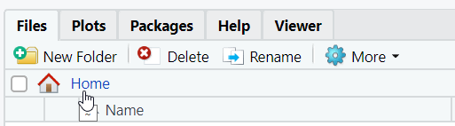

# UCLH data fellows practical tips

A collection of tips for working with data on UCLH systems.

<!-- for comments that won't appear online -->
<!-- ? or call it SOP will all know what sop stands for ? -->

Contents 

[UCLH Data Science Desktop](#uclh-data-science-desktop)  
TODO fill other links
[Secure transfer of data](#secure-transfer-of-data)  

These tips aim to support you to develop good data practice and make your work more efficient and safer.

Few of these are hard-and-fast rules. You may have good reasons for doing things differently.

Most of this assumes that you are using R. If you are using Python that is good too and you will need to adapt.

## UCLH Data Science Desktop

Using the UCLH Data Science Desktop allows you to access hospital data securely. R, dbforge for SQL and Python are pre-installed. See the
[pre-course instructions](https://github.com/uclh-criu/learning-datascience/blob/master/Instructions/01-pre-course-instructions.md) for details of access.

## Where to save data ?

Do not save data on the desktop of Data Science Desktop. It will be lost when your session ends.

Save data within your Documents folder on Data Science Desktop. This can be reached by typing File Explorer into the Windows search. RStudio is etup on Data Science Desktop so that your Documents folder is set as the 'Home' directory that can be reached by clicking Home in The Files tab at the lower right.

## RStudio projects

A good way of organising your own R work is by using RStudio projects. An Rstudio project is a folder than can contain both code and data files and has a `.Rproj` file that saves your settings.

One advantage of RStudio projects is that they help to keep related code and data together in one place.

We suggest you create a folder called rstudioprojects in your Home directory on Data Science Desktop and keep all your projects in there. 

To create a new RStudio project, click : 
File, New project, New directory, New project, & type in a name, e.g. my-first-project.

## Folder structure within RStudio projects

TODO add to
data etc. raw

## Secure transfer of data

You can receive/send data files (e.g. csv) via your NHS email account. To get files into Data Science Desktop open your email in a web browser in Data Science Desktop and save to your Home or Documents folders as suggested above.
