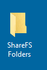
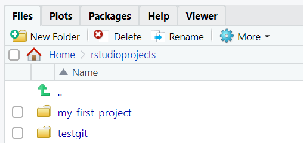
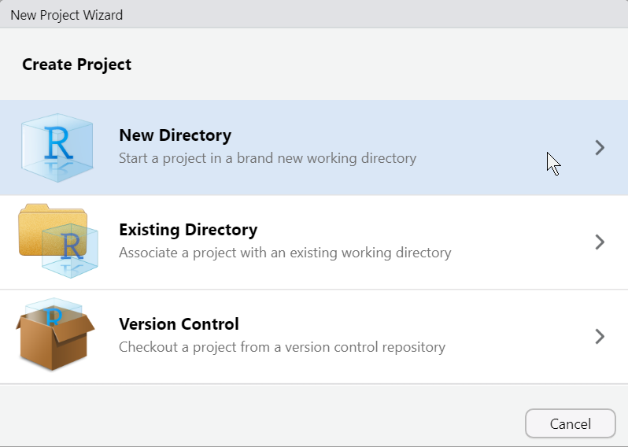
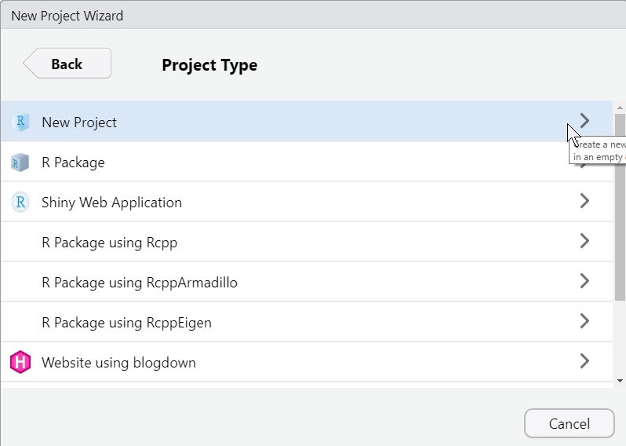
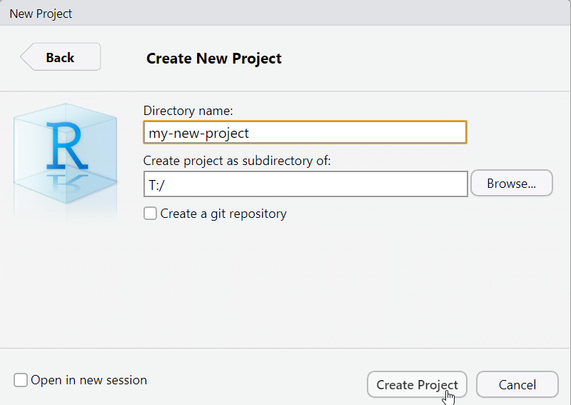
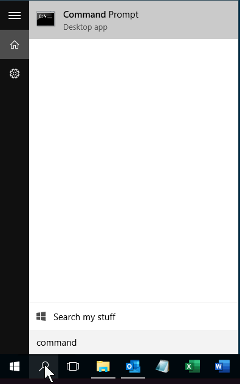
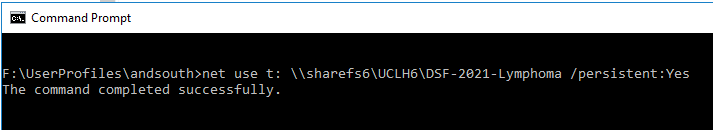

# UCLH data fellows practical tips

A collection of tips for working with data on UCLH systems.

<!-- for comments that won't appear online -->
<!-- ? or call it SOP will all know what sop stands for ? -->

Contents 

[UCLH Data Science Desktop](#uclh-data-science-desktop)    
[Where to save data](#where-to-save-data)     
[RStudio projects](#rstudio-projects)     
[Naming of files, columns, variables etc.](#naming-of-files-columns-variables-etc)    
[Folder structure within RStudio projects](#folder-structure-within-rstudio-projects)     
[Secure transfer of data](#secure-transfer-of-data)      

These tips aim to support you to develop good data practice and make your work more efficient and safer.

Few of these are hard-and-fast rules. You may have good reasons for doing things differently.

Most of this assumes that you are using R. If you are using Python that is good too and you will need to adapt.

## UCLH Data Science Desktop

Using the UCLH Data Science Desktop allows you to access hospital data securely. R, dbforge for SQL and Python are pre-installed. See the
[pre-course instructions](https://github.com/uclh-criu/learning-datascience/blob/master/instructions/01-pre-course-instructions.md) for details of access.

## Where to save data

Do not save data on the desktop of Data Science Desktop. It will be lost when your session ends.

Save data on Data Science Desktop either within your documents folder or a shared folder (and probably within an RStudio project - see below) :

1. within your Documents folder. This can be reached by typing File Explorer into the Windows search. RStudio is setup on Data Science Desktop so that your Documents folder is the 'Home' directory that can be reached by clicking Home at the top left of he Files tab at the lower right.

2. a shared folder. We have created some network shared folders that we will send you details of. You can find these by clicking on the ShareFS icon on Data Science Desktop.

## RStudio projects

A good way of organising your own R work is by using RStudio projects. An Rstudio project is a folder than can contain both code and data files and has a `.Rproj` file that saves your settings.

One advantage of RStudio projects is that they help to keep related code and data together in one place.

We suggest you create a folder called **rstudioprojects** either in one of the shared folders or in your Home directory on Data Science Desktop and keep all your projects in there. 

**To create a new RStudio project, click :**     

**RStudio, File, New project, New directory, New project, & type in a name, e.g. my-first-project**

To be able to create a new RStudio project within a shared folder you may need to create a drive letter (e.g. T:) for that folder to be able to see it in RStudio. Sometime the drive letters get created automatically. If you can't see the shared folder from within RStudio then you can create the drive letter yourself from the windows command prompt. Get to the windows command prompt by typing 'command' into the windows search box at the lower left, then double clicking on the Command prompt app.

That should bring up a black box that you can type something like this into to set a drive letter.

**net use t: \\sharefs6\UCLH6\DSF-2021-Lymphoma /persistent:Yes**    
    
replace **t:** with the drive letter of your choice   
replace **\\sharefs6\UCLH6\DSF-2021-Lymphoma** with the address of the shared folder we have let you know about.    
the **/persistent:Yes** ensures the drive persists when windows restarts

Note that if you wish to remove the shared drive letter and redo you can type :    

**net use t: /delete**   

Once the drive letter has been created you should be able to browse to it when you are creating a new RStudio project with :

**RStudio, File, New project, New directory, New project, & type in a name, e.g. my-first-project**

More [reasons for using RStudio projects](https://www.tidyverse.org/blog/2017/12/workflow-vs-script/) are outlined here by Jenny Bryan where she threatens to set on fire the computer of people who start their R scripts with something like setwd("C:/Users/jenny/")

## Naming of files, columns, variables etc.

It is good to have a system for naming things. Various systems are available.

Many recommend to **avoid spaces, accents, capital letters and special characters in names**.

This is a simple system we recommend :

File and folder names like this using **-** to separate words :    
**my-usefully-named-file.txt**    
**2022-02-patient-data-myeloma.csv**    
**my-usefully-named-r-script.r**    

Column names, object and function names in R using **_** to separate words :    
**weight_kg**    
**n_patients**    

## Folder structure within RStudio projects

When you create a blank RStudio project it has no internal folders. Carefully considering the folder structure can make your life much easier later.

For a small starting project. It can be simplest just to separate code and data.

For this we suggest the following internal folders :

**data-raw/**    
**data/**    

data-raw/ is for data that you have obtained (e.g. csv or xls) and you should keep it unmodified.    
data/ is for data that you are using yourself and may have modified. It could bs .csv or saved from R as .rds

If you have sql code add this :        
**sql/**    

You can then store R scripts or RMarkdown files in the home directory of the project.

This is similar to the [structure recommended by rfortherestofus](https://rfortherestofus.com/2021/08/rstudio-project-structure/), except that he also suggests having an **R/** folder to contain R scripts that can be used from within different RMarkdown documents.

Within this structure you can have files named something like this in the home directory of the project in the sequence that they need to be run. These could also be .Rmd files.    
0-get-data.R    
1-clean-data.R    
2-plot-data.R    
3-model-data.R    

For larger projects you may want to have folders named similarly to the files above.

You may also want to create folders for outputs of the project like **plots/** or **tables/**.

## Secure transfer of data

You can receive/send data files (e.g. csv) via your NHS email account. To get files into Data Science Desktop open your email in a web browser in Data Science Desktop and save to a subfolder of your Documents folder as suggested above.

