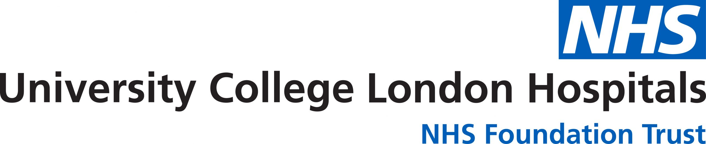

## Hello!

- Course objectives
- Introductions
- Pre-requisites
- Course schedule
- What to expect from sessions

## Course objectives (brief version)

- make you (more) comfortable with R

- introduce you to good-enough data practice

- that after the 2 days you will know how (& be motivated) to find out more

### Introductions

- a few sentences each, start with instructors

## Pre-requisites

- Access [Collaborative document](https://nhs-my.sharepoint.com/:w:/g/personal/mei_bai_nhs_net/ERBkMbqA6QVAo6DOtqNxVfQBBBwvGvroM5yO3e_3Vy_Xtg?e=TIhNZt) for tracking progress, entering questions etc.
\newline
\newline
- access R online: [http://uclvldddtaeas01.xuclh.nhs.uk:4433](http://uclvldddtaeas01.xuclh.nhs.uk:4433) you should have been sent password, let us know if not.
\newline
\newline
- Backup plan : if need to run locally download [R](https://cran.r-project.org/) & [RStudio](https://www.rstudio.com/products/rstudio/download/#download)

### Course schedule

- 2 days of intensive learning [link to schedule](https://github.com/ucl-criu/learning-datascience/blob/master/Instructions/schedule.md)

- we will be flexible & adapt as needed

## What to expect from the sessions

- we will follow a learning by doing approach
- getting you interacting with R early

- don't worry if you don't understand everything at the start
- do feel free to ask us questions at any time

I expect to fail to avoid doing these at some point :

a) assume you know things that you don't
b) patronise you by explaining things you already know

Please feel free to tell me.

# Thank you. We hope you enjoy the course. 
