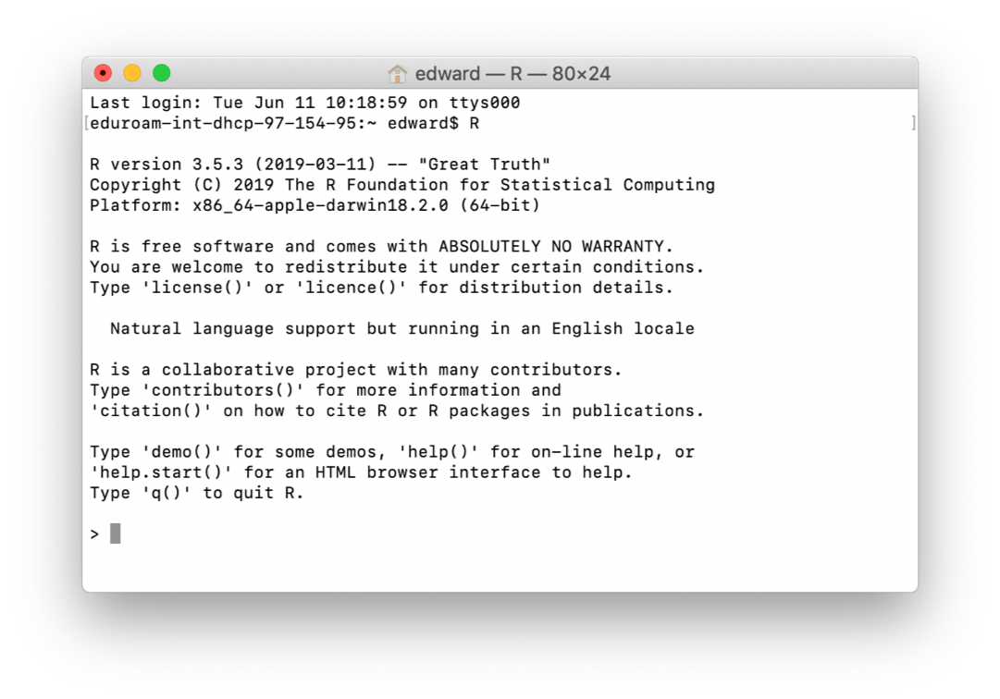
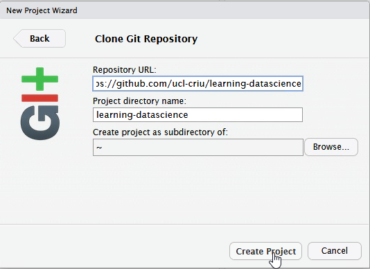

## Rationale

- in this session we will give you a quick taste of R 
- to show you what you can do
- we will get you to type commands in R and see what happens
- we don't expect you to understand completely at this stage
- we will return to concepts later

## Content

- download a project from Github into RStudio
- read in data from a file
- look at the data
- manipulate the data
- plot the data

## If you don't see something like this, let us know and we'll help

## Working with RStudio 

- RStudio is an Integrated Development Environment (IDE).
-- (also the name of the company that develops it and a lot more)
- Easier to work with than R on it's own, since it it a bit more 'point and clicky'
- Allows
    - Code editing
    - Syntax highlighting
    - Plotting tools
    - Workspace management
    - Version control

## This is what R on it's own looks like

## RStudio is much easier to work with & what we recommend

::: notes
Explain each window.

- Console - this is where R is run. Commands executed but not saved.
- Source - text files that contain commands.
- Environment - tells you which R objects you are working with.
- Files - actually a helper window. Gives you files, help, plots.
:::

## Using the Source/Text editor

- Type `2 + 2` in top left, then `Enter`.
- What happens?
- To ask R to run code

- Highlight the code and:
    - MacOS: `Cmd + Enter`
    - Windows: `Ctrl + Enter`

- Notice the output in the console.

## A warning about R warnings & errors

DON'T PANIC : they are common & expected

`Warnings` give you info that often you can ignore

`Errors` usually need to be fixed and are usually due to a typo

`Errors` check the first one - if it doesn't make sense to you google it

## If you are an Instructor switch to live demo in RStudio 

If you are learning independently follow the steps in these slides.

## download a project from Github into RStudio

##

## 

## Copy into first box **https://github.com/ucl-criu/learning-datascience**

## may take a while to copy files.

## Intructor will step through sessions/1-R-taster-script.R

