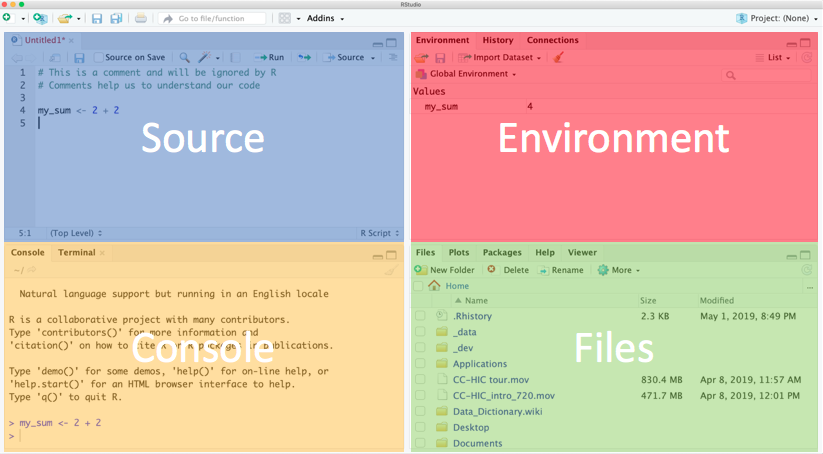
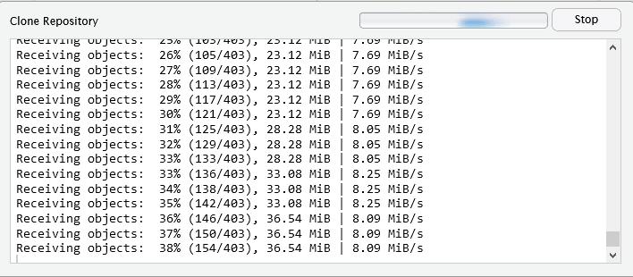

## Rationale

- in this session we will give you a quick taste of R 
- to show you what you can do
- we will get you to type commands in R and see what happens
- we don't expect you to understand completely at this stage
- we will return to concepts later


## Content

- download a project from Github into RStudio
- read in data from a file
- look at the data
- manipulate the data
- plot the data

## UCLH Data Science Desktop If you don't see something like this, let us know and we'll help


## RStudio fom Data Science Desktop

To start RStudio type 'rst' in the search box at the lower left, an then double click on the RStudio desktop app.


## Working with RStudio 

- RStudio is an Integrated Development Environment (IDE).
-- (also the name of the company that develops it and a lot more)
- Easier to work with than R on it's own, since it it a bit more 'point and clicky'
- Allows
    - Code editing
    - Syntax highlighting
    - Plotting tools
    - Workspace management
    - Version control

## This is what R on it's own looks like


## RStudio is much easier to work with & what we recommend



::: notes
Explain each window.

- Console - this is where R is run. Commands executed but not saved.
- Source - text files that contain commands.
- Environment - tells you which R objects you are working with.
- Files - actually a helper window. Gives you files, help, plots.
:::

## Using the Source/Text editor

- Type `2 + 2` in top left, then `Enter`.
- What happens?
- To ask R to run code

- Highlight the code and:
    - MacOS: `Cmd + Enter`
    - Windows: `Ctrl + Enter`

- Notice the output in the console.


## A warning about R warnings & errors

DON'T PANIC : they are common & expected

`Warnings` give you info that often you can ignore

`Errors` usually need to be fixed and are usually due to a typo

`Errors` check the first one - if it doesn't make sense to you, google it


## First time from UCLH PC 

### To enable RStudio to find internet
 
Create a small text file, paste some commands into it, save it as a file called .Renviron and then restart RStudio.

We can use a function called `edit_r_environ()` within a helper package called `usethis`.

Copy & paste the 3 lines below into the R console at the lower left:

```
install.packages("usethis")
library(usethis)
usethis::edit_r_environ()
```

This should open a tab called **.Renviron** in the editor at the top left.


## Copy & paste these lines into a space below the **.Renviron** tab at top left

```
# Set-up proxies to allow RStudio & R to talk to internet
# allows git cloning of RStudio projects & remotes::install_github
# CRAN package installation works without proxies being set
# file called .Renviron needs to be saved in your home folder
http_proxy=http://www-cache-n.xuclh.nhs.uk:3128/
https_proxy=http://www-cache-n.xuclh.nhs.uk:3128/
HTTP_PROXY=http://www-cache-n.xuclh.nhs.uk:3128/
HTTPS_PROXY=http://www-cache-n.xuclh.nhs.uk:3128/
```

Then save that file by selecting File, Save (or Ctrl S).   
Close the .Renviron tab.   
Restart RStudio.

## If you are an Instructor switch to live demo in RStudio 

If you are learning independently follow the steps in these slides.

## download a project from Github into RStudio


##


## 


## Copy into first box **https://github.com/uclh-criu/learning-datascience**


## may take a while to copy files.



## Intructor will step through sessions/1-R-taster-script.R


