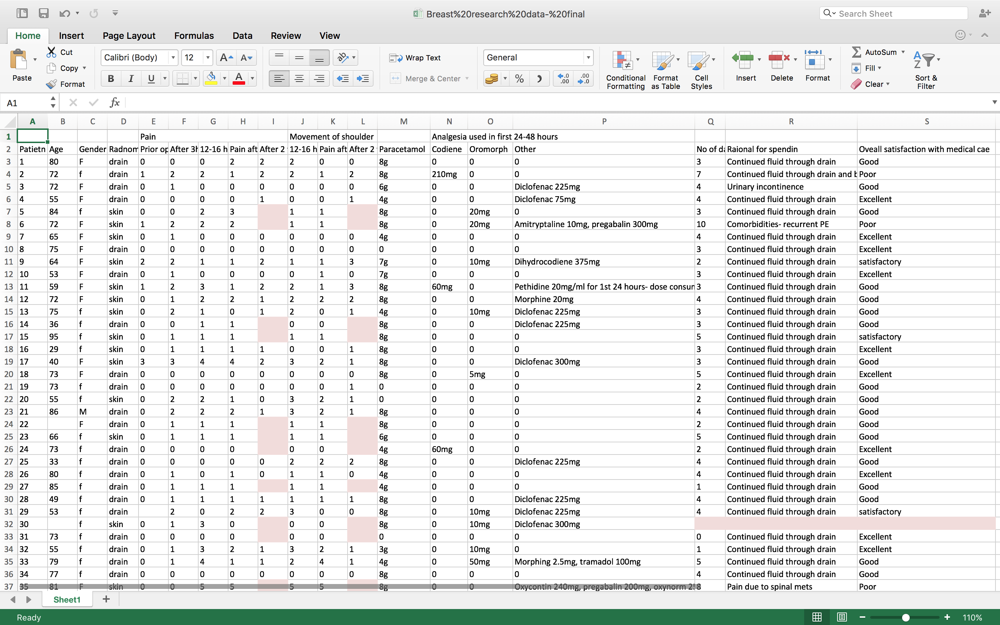

# Learning Objectives 

- Understand what is 'Tidy data'
  - each column is a variable
  - each row is an observation
- Learn about data types (columns)
- Best practices for recording data
- Common data mistakes


# Tidy data


# "Tidy datasets are all alike ... every messy dataset is messy in its own way"


# Tidy data example from [here](https://www.r-bloggers.com/2018/03/thoughts-on-teaching-r-and-yet-another-tidyverse-intro/)


# Tidy data allows approaches to be re-used


# Tidy data allows for easier sharing, both with others & your future self


# Credit for stats cartoons

- Artwork by @allison_horst
- [https://github.com/allisonhorst/stats-illustrations](https://github.com/allisonhorst/stats-illustrations)
- [https://www.openscapes.org/blog/2020/10/12/tidy-data/](https://github.com/allisonhorst/stats-illustrations)


# Other main good practice

- Keep data rectangular
- Never try to record more than one "type" of thing in a column
- Just one header row
- Put units in column heading, not in individual cells  


# Data types


# Data types

## Integers & Decimals

- `...,-3,-2,0,1,2,3,...` versus `3.141529`
- Whole numbers versus any number with a decimal point

## Characters & Strings (any sequence of characters) 

- Literally anything you can type can be represented as a string. 
- Default type in Excel & in R if it can't be recognised as anything else
- ` 180mg ` is not a number!

# Data types (contd)

## Dates & Times (beware tricky!)
  \n
- Try to use [ISO 8601](https://en.wikipedia.org/wiki/ISO_8601) date format : **YYYY-MM-DD**  
- Many advantages
- e.g. 2021-08-23
- **YYYY-MM-DD HH:MM:SS** optional time added
   \n
NOT : 2021:08:23 or 20210823 or 21-08-23 

  \n
  
- computers (e.g. Excel & R) store dates in a range of ways
- problems occur in conversions
- Package `lubridate` in R is good

# Data types (contd)

## TRUE or FALSE (Booleans)

- `TRUE` or `FALSE` statements.
- `1` or `0` is a common shorthand
- in R you may see `T` or `F` used. **DON'T** (can lead to problems because `T` & `F` can be redefined)

# Categorical or Factor data

- Sometimes R can convert character strings to Factors
- Common source of confusion in R (still trips me up sometimes)

### Nominal

- An **un**ordered factor

```
- apples, oranges, pears
```
- R stores this as `1,2,3` for convenience but not because `1<2<3`.

### Ordinal

- Ordered, e.g. Likert scale

```
- Disagree, Neither agree/disagree, Agree
```
- R stores this as `1,2,3` for convenience and understands that `1<2<3`


# Exploring Datatypes in RStudio

## Your turn ...

In RStudio,

```
integers <- as.integer(c(1, 3, 15, 16))
decimals <- c(1.4, 3.5, 15.55, 16.4)
bools <- c(TRUE, TRUE, FALSE, TRUE)
dates <- as.Date(c("22/04/2016", "13/05/1997"), format = "%d/%m/%Y")
strings <- c("These are", "Strings")
factors <- as.factor(c("Apples", "Pears", "Lemons"))
factors <- as.factor(c("Good", "Better", "Best"), ordered=TRUE)
```

then use `str()` to see the data 'structure'


# Cardinal rules for data in spreadsheets

<!-- - [ ] TODO(2016-05-26): need to explain the 'header row' concept -->

## Columns

> Put all your **variables in columns** - the thing you're measuring, like 'weight', 'temperature' or 'SBP'. Break things down into their most basic constituents, and keep units in your headers only.

## Rows

> Put each **observation in its own row**. Think very carefully about what constitutes your basic observation. Often it's your patient, but it may not be as intuitive as you think.

#

## Headers

> Have a single 'header' row to label your columns 

## Cells

> **Don't combine multiple pieces of information in one cell**.

> **Leave the raw data raw** - don't mess with it! That means no formulas anywhere in your spreadsheet!

## Sharing

> Export the cleaned data to a **text based format** like CSV. This ensures that anyone can use the data, and is the format required by most data repositories.


# The computer doesn't care about formatting


# We do ... all Excel does is present it to us in an easy to use format


# But ...

> Remember that you need to go back and forth between both formats.

> So merged cells, colours, comments will both be lost and confuse.


# Your turn ...

## The data

- Raw data from an RCT on pain relief following mastectomy
- Download from [FigShare](https://figshare.com/s/165cad3ce6eadbf6b19a).

# Original (dirty)



# Your mission ...

Identify and fix these common mistakes


# Common mistakes

<!-- - [ ] TODO(2016-05-26): this would work nicely as a round robin teaching exercise; get each pair to read one section and teach the rest of the glass; repeat twice if needed to get through the whole list -->


- [Multiple tables](3-common-mistakes-sheet.html#tables)
- [Multiple tabs](3-common-mistakes-sheet.html#tabs)
- [Not filling in zeros](3-common-mistakes-sheet.html#zeros)
- [Using bad null values](3-common-mistakes-sheet.html#null)
- [Using formatting to convey information](3-common-mistakes-sheet.html#formatting)
- [Using formatting to make the data sheet look pretty](3-common-mistakes-sheet.html#formatting_pretty)
- [Placing comments or units in cells](3-common-mistakes-sheet.html#units)
- [More than one piece of information in a cell](3-common-mistakes-sheet.html#info)
- [Field name problems](3-common-mistakes-sheet.html#field_name)
- [Special characters in data](3-common-mistakes-sheet.html#special)
- [Inclusion of metadata in data table](3-common-mistakes-sheet.html#metadata)


# Tips

- First copy the spreadsheet - don't mess with the raw data !
- In the copy make 3 sheets: readme, dictionary, data 
- For this example modify the data in Excel - when you get more proficient you can do from R
- Start with a few columns, don’t need to do all
- Finally export the data sheet to CSV
- For extra points, try reading the CSV into R with read_csv("[filename.csv]")


