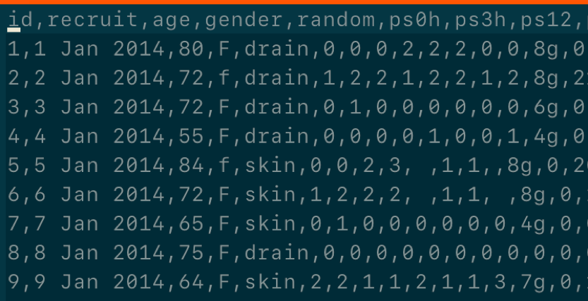
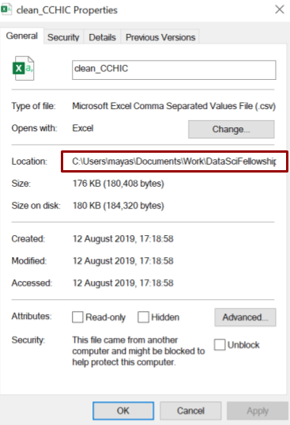
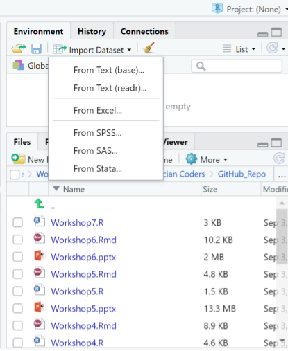
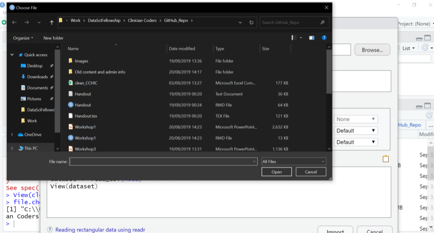
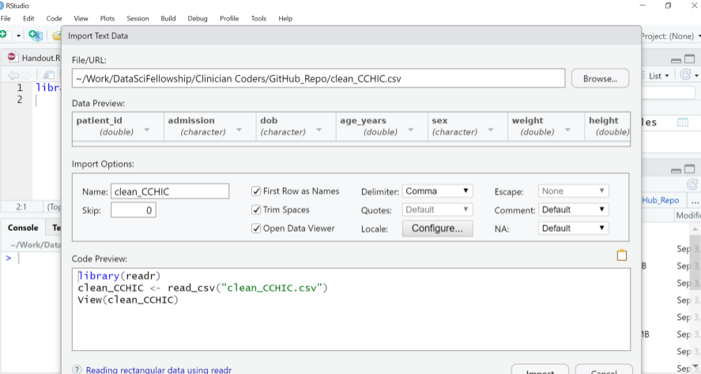

```{r, include=FALSE}
library(readr)
cchic <- read_csv("../data/clean_CCHIC.csv")
```


## What will this workshop teach you?

1.  Getting `csv` files into R  
2.  Initial exploration of your data set  
\newparagraph


## Introduction
- You have now learnt to input data into R manually  
- But what happens if you are given an Excel spreadsheet and told to analyse it?  
  - How can you look at and work with that data in R?
  
## The Data

- We will use a synthetic dataset (5k rows) similar to the Critical Care Health Informatics Collaborative data.
- Data look real, but aren't. 
- Multicentre Adult ITU database
    - 11 adult ICUs
    - 5 UK teaching hospitals
    - Privacy ensured through “highest standards of data security”
    - 18, 074 unique patients

- Thankyou to the ClinicianCoders project who created the data (& many of these slides!)
  
## What is a CSV file?
::::::::::::{.columns}
:::{.column}
- *Comma separated values* file  
- You still have columns and rows       
- But data values on a single row are separated by commas instead of walls of a cell  
- Excel spreadsheets are easily converted into this format
:::
:::{.column}

:::
:::::::::::: 


:::
:::::::::::: 

## Files, Directories and File Paths
- R can not read your data if it does not know where it is stored  
- Your computer has a system for storing files within directories 
- Directories are also known as folders  
- The language used to instruct on the location of the file in known as the `file path` 

## File Paths
::::::::::::{.columns}
:::{.column}
- Starts with a `Root Directory` and then `Branches` are specified
- You can find out the file path name by right clicking on any file:
  - `Properties` in Windows
  - `Get Info` in Mac  
- Folders within directories are specified with:
  - `/` in Mac & Unix 
  - `\\` in Windows

:::
:::{.column}

:::
::::::::::::

## Finding and setting your Working Directory
::::::::::::{.columns}
:::{.column}
- R would have chosen a working directory for you  

```{r, eval=FALSE}
getwd()
```

- Will display your working directory in your console  
- You can then reset it to your desired working directory using 

```{r, eval=FALSE}
setwd()
```

- However using RStudio projects reduces the need to use `setwd()`

:::
:::{.column}

:::
::::::::::::


## Getting your work into R  
There are 3 main methods

1.  Point and click  

      - Less fiddly as no need to write code   
      
      - But not reproducible  

2.  Using commands  

      - Better for reproducibility
      
      - Someone else would just have to replace the source code to run the code on their own computer  
      
3.  Connecting to an online database or google spreadsheet (not covered here)

## Method 1: Point and click
::::::::::::{.columns}
:::{.column}
Click `Import Dataset` tab in the `Environment` pane  

:::
:::{.column}

:::
::::::::::::

##  
::::::::::::{.columns}
:::{.column}
- Choose `From text (readr)`
:::
:::{.column}

:::
::::::::::::

## Browse Files
::::::::::::{.columns}
:::{.column}
- Now browse for your file  
- Click on the file you wish to select  
- Then select `Import`  
- IF you try this you will notice there is no text in the source pane. This method is not reproducible.  
:::
:::{.column}

:::
::::::::::::

## How can I make this reproducible? 
::::::::::::{.columns}
:::{.column}
- Look for the code in the `Code Preview`
- You can copy and paste this code into your source pane to make this step reproducible 
:::
:::{.column}

:::
::::::::::::

## Method 2: Commands
- `readr` is a package containing functions to help R *read* your external files  
- It is automatically installed with `tidyverse`  
- Remember we have installed already so now load the packages with `library()`  

```{r, eval=FALSE}
library(tidyverse)
```

## Read your file

- You can then tell R to read a CSV file by writing the full file path name. 

- Because we are working in an RStudio project we can use a **relative file path**

```{r, eval=FALSE}
# You creating an object called "cchic" to contain the data
cchic <- read_csv("data/clean_CCHIC.csv")
```

- (use double dot `..` if you need to go above the current working directory)

Display the contents of the data frame `cchic` in R

```{r, eval = FALSE}
cchic
```


## data is imported as a `tibble` - a special type of dataframe


## Viewing Your Data in R
::::::::::::{.columns}
:::{.column}
- You have imported your data into R.
- You need a neat way of looking at it. 

```{r, eval=FALSE}
View(cchic)
```

- The data is displayed in a familiar spreadsheet format. 
  - This is a more human-legible table  
  - You can also view the data via the environment pane
:::
:::{.column}
.png)
:::
::::::::::::


## Reviewing your data in R

Spreadsheets in R are called data frames 
You can use these functions to investigate your data frame: 

- `head(cchic)`  
- `tail(cchic)`  
- `names(cchic)`  
- `str(cchic)`  
      
## head()

```{r, eval = FALSE}
head(cchic)
```

Prints the first 6 rows of the data frame.

## tail()

```{r, eval = FALSE}
tail(cchic)
```

Prints the last 6 rows of the data frame.

## names()

```{r, eval = FALSE}
names(cchic)
```

Prints the names of the variables. 

## str()

```{r, eval = FALSE}
str(cchic)
```

Prints the data type of each variable.

## Look at specific items.

You can look at specific data points.

```{r}
cchic[21, 5]
```

This displays the the piece of data in the 21st row and 5th column.

## Selecting variables using $ sign.

- You can also use the `$` function
- Enter `data_frame_name$variable_name`

```{r, eval=FALSE}
cchic$weight
```

- This will list all of the data in the weight column

## `table()` `range()` `min()` `mean()` & other tools to review data

- Specific functions from other packages can help you describe datasets
- e.g. 

- `table()` gives the number of unique values in a column
- `range()` `min()` `mean()` work on numeric columns
- BEWARE if a column contains any NA values these will return NA, unless you specify `na.rm=TRUE`
- try with & without :
```{r, eval=FALSE}
range(cchic2$urea, na.rm=TRUE)
```


## Exercise
1. What types of variables do you have in `cchic`?
2. Display the `discharge_dttm` vector from `cchic`.
3. How many men and women are in the database?
4. How many survived and how many died?
5. a) What does the function `ls()` do? 
   b) Use it to see how many vectors contain information about "temp"
  
## Answer 1.
What types of variables do you have in `cchic`?

```{r, eval=FALSE}
str(cchic)
```

## Answer 2
Display the `discharge_dttm` vector in `cchic`.
```{r, eval = FALSE}
cchic$discharge_dttm
```

## Answer 3
How many men and women are in the database?
```{r}
table(cchic$sex)
```

## Answer 4
How many survived and how many died?
```{r}
table(cchic$vital_status)
```

## Answer 5
What does the function `ls()` do?
```{r}
ls(cchic, pattern = "temp")
```

This lists all of the variables containing the word "temp".

