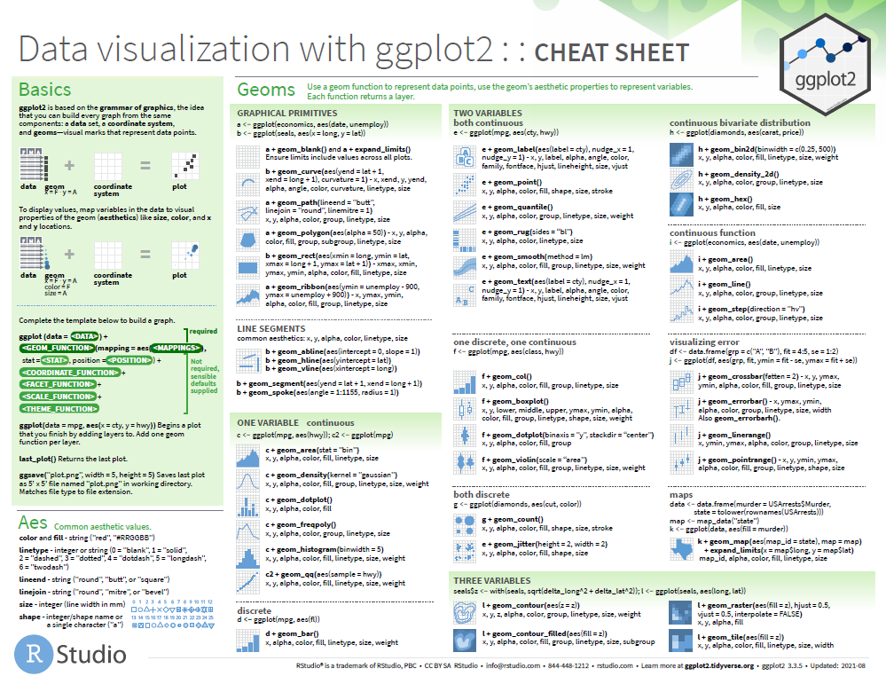
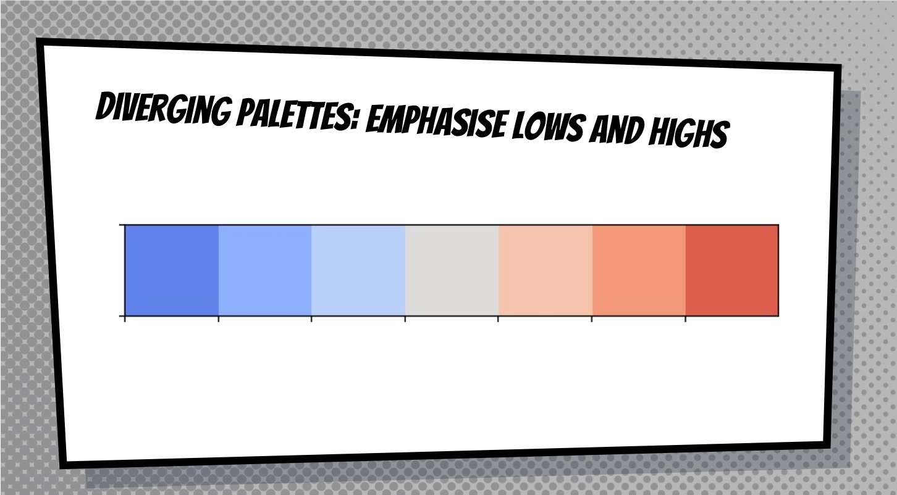
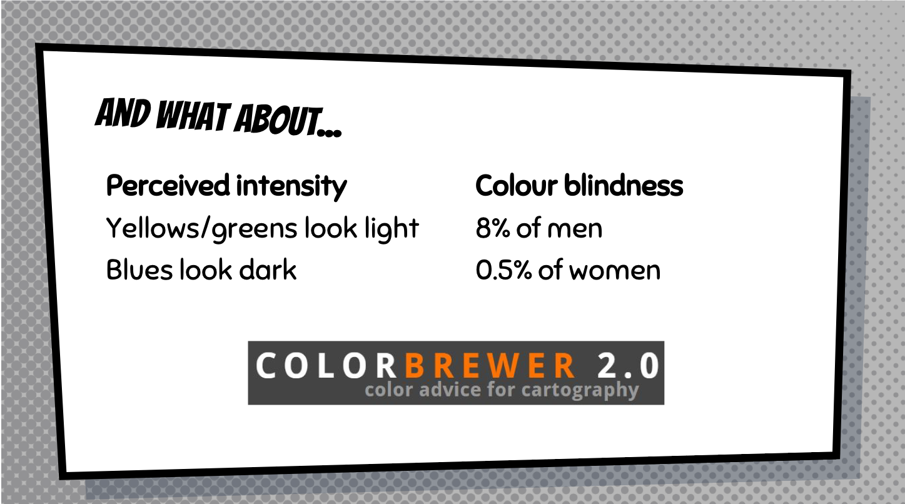

```{r, include = FALSE}
# We will need this data later.
library(tidyverse)
library(lubridate)
library(ggplot2)
cchic <- read_csv("../data/clean_CCHIC.csv")
```


## Content

- Visualising Data in R with `ggplot2`

- General data visualisation tips


## What can data visualisation do ?

1. help you to explore & understand your data

2. communicate your data


## Visualising data in R with `ggplot2`

- There are many ways to plot graphs in R
- Base R has visualisation commands

- `ggplot2` package allows you to 'layer' features of graphs
- works well with tidy data
    - it is part of the tidyverse, load it now with
    - `library(ggplot2)` or `library(tidyverse)`
- (called `ggplot2` because the first version had problems! confusingly the main command is still called just `ggplot` )    


## `ggplot2` resources

- ggplot is hugely popular (hundreds thousands of users)
- lots of resources
- but there is a bit of a learning curve
- "It’s hard to succinctly describe how ggplot2 works because it embodies a deep philosophy of visualisation."
- most useful reference website[https://ggplot2.tidyverse.org/reference/index.html](https://ggplot2.tidyverse.org/reference/index.html)


## 'cheatsheet' in folder of this course project




## Structure of a ggplot command

- takes a while to get used to the structure.
- Different syntax possible

In general:

```{r, eval = FALSE}
ggplot(DATA) + 
  GEOM_FUNCTION(aes(WHICH COLUMNS INFLUENCE AESTHETICS))
```

  \n

I usually start by copying & pasting some existing code & modifying it.


## What is a 'aes' ?

- `aes` sets the columns that influence the aesthetics of the plot
- it can go either after the GEOM part or after the DATA part
- ggplot(DATA) + GEOM(aes(x=COLUMN))
- ggplot(DATA, aes(x=COLUMN)) + GEOM()
- makes a difference if you add other geoms

## What is a 'geom' ?

A `geom` is a visual aspect of a graph.

- dots
- lines
- bars

Look at the `ggplot2` cheatsheet for more options.


## move to the file : ** 5-visualise-script-ggplot.R **


## raw value plots vs summaries 


## Drawing a bar graph

- `geom_bar` 

```{r, eval = T, message=FALSE}
ggplot(data = cchic) +
  geom_bar(mapping = aes(x = vital_status))

```

## Adding a second aesthetic

```{r, eval = T, message=FALSE}
ggplot(data = cchic) +
  geom_bar(mapping = aes(x = vital_status, fill = sex))
```


## Scaling bars to 1

```{r, eval = T, message=FALSE}
ggplot(data = cchic) +
  geom_bar(mapping = aes(x = vital_status, fill = sex), position = "fill")
```


## A few more general datavis guidelines to consider

## Position on X & Y axis is most effective communicator - use it for your prime variables


## 


## 


## 



## 




