```{r, include = FALSE}
# We will need this data later.
library(tidyverse)
library(lubridate)
library(ggplot2)
cchic <- read_csv("../data/clean_CCHIC.csv")
```


## Content

- Visualising Data in R with `ggplot2`

- General data visualisation tips


## What can data visualisation do ?

1. help you to explore & understand your data

2. communicate your data


## Visualising data in R with `ggplot2`

- There are many ways to plot graphs in R
- Base R has visualisation commands

- `ggplot2` package allows you to 'layer' features of graphs
- works well with tidy data
    - it is part of the tidyverse, load it now with
    - `library(ggplot2)` or `library(tidyverse)`
- (called `ggplot2` because the first version had problems! confusingly the main command is still called just `ggplot` )    

## Structure of a ggplot command

It takes a while to get used to the structure.

There are different forms of syntax.

Different syntax possible

But in general:

```{r, eval = FALSE}
ggplot(data = date_frame_name) +
  style_of_plot(mapping = aes(x = column_name1, y = column_name2))
```

::: notes 
This will become more clear once we see examples
:::

## ggplot is very versatile

You can use the same structure for many types of graphs.

```{r, eval = FALSE}
ggplot(data = date_frame_name) +
  style_of_plot(mapping = aes(x = column_name1, y = column_name2)) +
  other_arguments
```

::: notes
Explain a couple of things you can add on using the + sign.
:::

## What is a 'geom'?

A `geom` is a visual aspect of a graph.

- dots
- lines
- bars

Look at the `ggplot2` cheatsheet for more options.

## Live code dot plot with `geom_point`


## Let's create a line graph together

::: notes
Get them to type this code in and draw the graph. The graph they should get is on the next slide.
:::

```{r, eval = T, message=FALSE}
ggplot(data = cchic) +
  geom_smooth(mapping = aes(x = wbc, y = crp))
```

## Adding a linetype

```{r, eval = T, message=FALSE}
ggplot(data = cchic) +
  geom_smooth(mapping = aes(x = wbc, y = crp, linetype = sex))
```

## Adding colour 

```{r, eval = T, message=FALSE}
ggplot(data = cchic) +
  geom_smooth(mapping = aes(x = wbc, y = crp, colour = sex))
```


## Combining multiple geoms

```{r, , message=FALSE}
ggplot(data = cchic) +
  geom_point(mapping = aes(x = wbc, y = crp, colour = sex)) +
  geom_smooth(mapping = aes(x = wbc, y = crp))
```

## Bar Graph

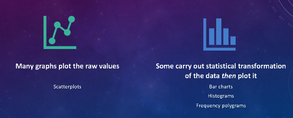

## Drawing a bar graph

- `geom_bar` 

```{r, eval = T, message=FALSE}
ggplot(data = cchic) +
  geom_bar(mapping = aes(x = vital_status))

```

## Proportion instead of count

```{r, eval = T, message=FALSE}
ggplot(data = cchic) +
  geom_bar(mapping = aes(x = vital_status, y = ..prop.., group = 1))
```

## Adding a second aesthetic

```{r, eval = T, message=FALSE}
ggplot(data = cchic) +
  geom_bar(mapping = aes(x = vital_status, fill = sex))
```

## Standardising proportions

```{r, eval = T, message=FALSE}
ggplot(data = cchic) +
  geom_bar(mapping = aes(x = vital_status, fill = sex), position = "fill")
```

## Changing position of bars

```{r, eval = T, message=FALSE}
ggplot(data = cchic) +
  geom_bar(mapping = aes(x = vital_status, fill = sex), position = "fill")
```

# Create your own plots now!


## A few more general datavis guidelines to consider

## 


## 

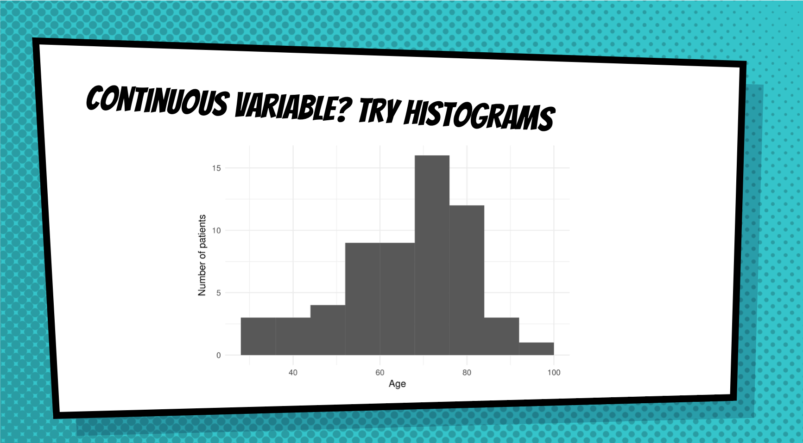

## 

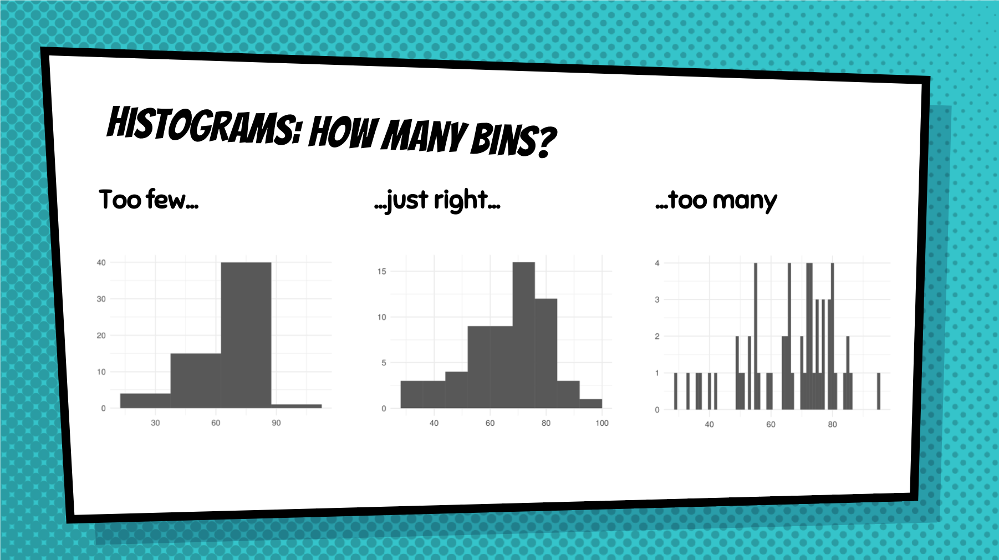

## 

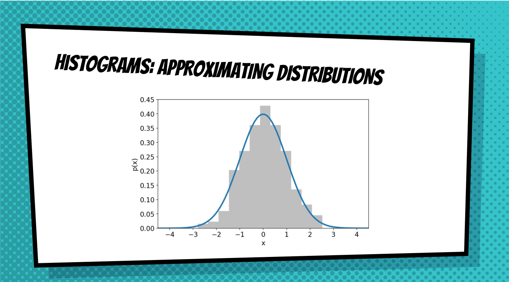

## 

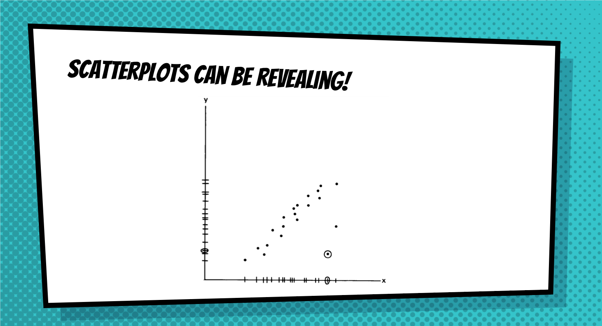


## 


## 

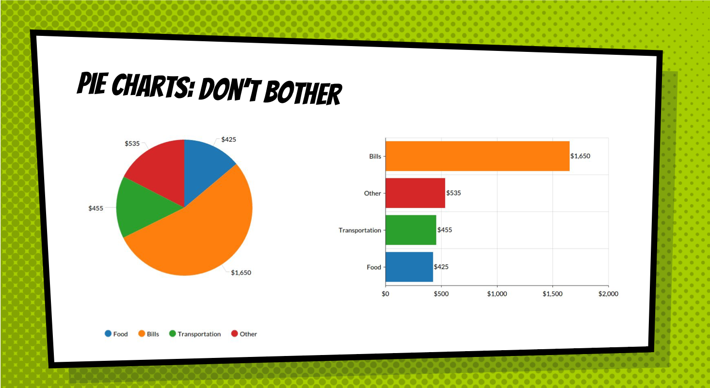

## 

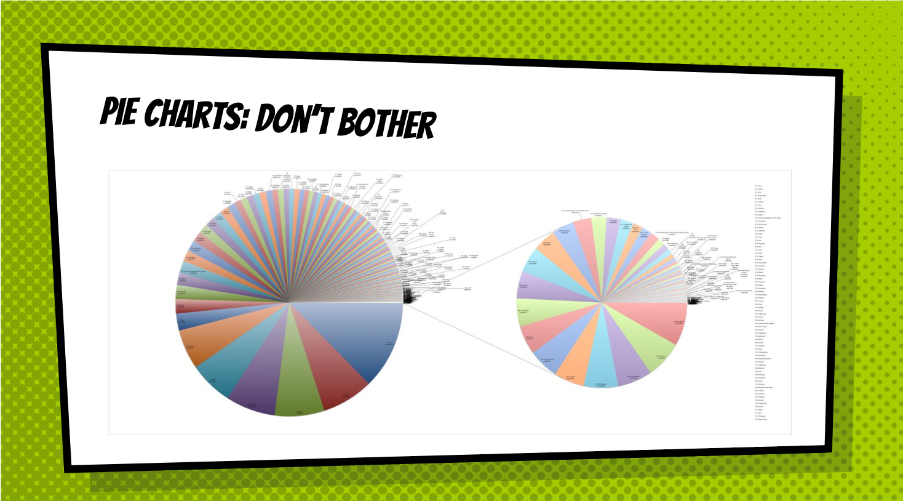

## 

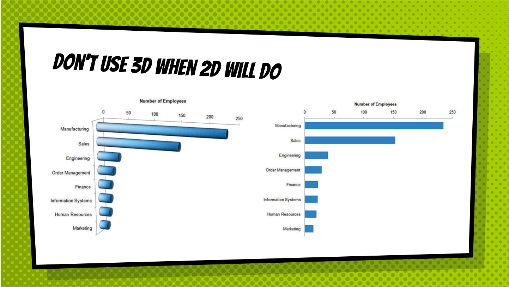

## 

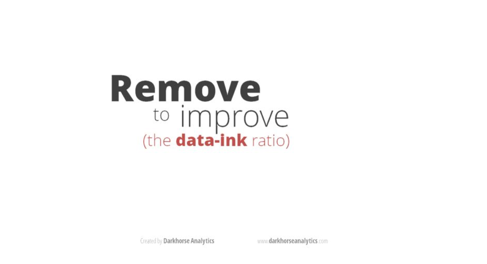


## 

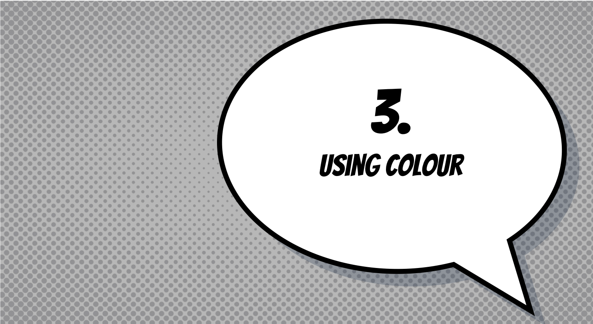


## 

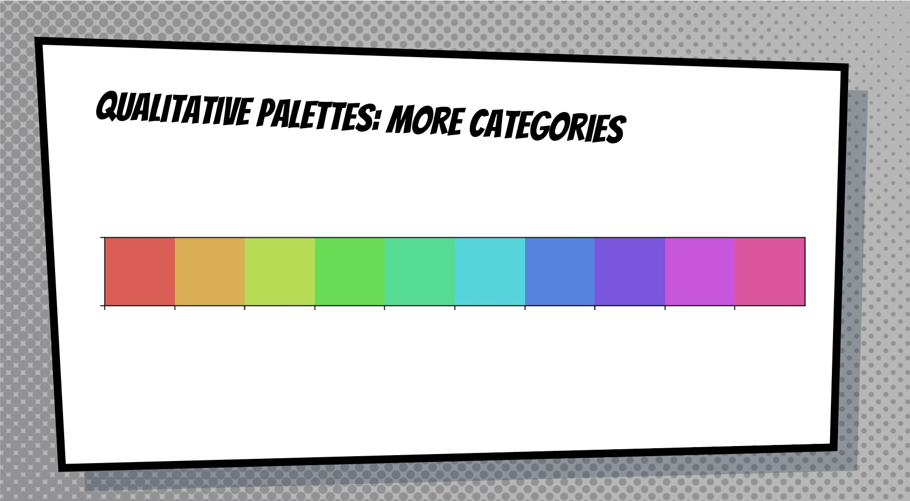

## 


## 


## 


