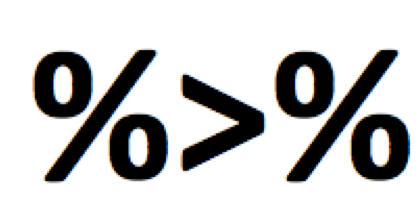

```{r, include = FALSE}
# We will need this data later. 
library(tidyverse)
library(lubridate)
cchic <- read_csv("../data/clean_CCHIC.csv")
cchic <- cchic %>%
  mutate(los = difftime(ymd_hms(discharge_dttm),
                        ymd_hms(arrival_dttm), units = "days"))
```

## Content

- Using the `dplyr` package for data manipulation
- Standard methods for choosing data
- Recipes to perform common operations
    - Manipulating strings
    - Manipulating dates
    - Changing data structure

## [dplyr](https://dplyr.tidyverse.org/) a grammar of data manipulation

dplyr functions:

    `mutate()` adds new columns
    `select()` picks variables (COLUMNS) based on their names.
    `filter()` picks cases (ROWS) based on their values.
    `summarise()` reduces multiple values down to a single summary.
    `arrange()` changes the ordering of the rows.

    `group_by()` allows you to perform any operation “by group”. 
    
## dplyr is part of the tidyverse

```{r, eval=FALSE}
# You only need to install once.
install.packages("tidyverse")

# You need to load packages each time you open R.
library(tidyverse)
```


## The pipe `%>%` an optional but useful operator

:::::::::::::: {.columns}
::: {.column}
- Takes whatever you did before
- Passes it to the next function (first argument)
- Whenever you see it, think of the word 'then' 
- `object %>% function1() %>% function2()`
- "hello" %>% substr(2,4) %>% toupper()
- Shortcut - `Cmd + Shift + M` (Mac) `Ctrl + Shift + M` (Windows)
:::
::: {.column}

:::
::::::::::::::


## Logical operators

- You use them to compare values
    - `==`   (equal to)
    - `!=`   (not equal to)
    - `>, <`   (greater than, less than)
    - `>=, <=`   (greater than or equal to, less than or equal to)
    - `is.na()`   (is the value missing)

- More than one condition?
    - `&`   (and)
    - `|`   (or)

::: notes
This is the second thing we need to learn. It applies to most parts of R.
:::

## Example of using logical operators

- `age >= 18`
- `age >= 18 & age <= 60`

::: notes
For instance, when you are selecting something
:::

## Filter ROWS

Choose rows based on the conditions you specify.

```{r, eval = FALSE}
cchic %>%
  filter(age_years >= 65)
```

The output is a data frame where all patients are 65 years or older.


## Select COLUMNS

Allows you to choose specific columns from your dataset.

```{r, eval = FALSE}
cchic %>%
  select(sex)
```

Output is a data frame with the gender of all patients.


## Using filter and select together

```{r, eval = FALSE}
cchic %>%
  filter(age_years >= 65) %>%
  select(sex)
```

Output is the gender of patients who are 65 years or older.

What happens if you do `select()` and then `filter()`? 

  \n

You have removed the age variable from the dataset, so you can’t filter based on age.

## Piped data with functions

Piped data can be passed on to almost any function in R

```{r, eval = FALSE}
cchic %>%
  filter(age_years >= 65) %>%
  select(sex) %>%
  summary()
```

Gives information on gender for patients older than 65.


## Example of using group by and summarise


```{r, eval = FALSE}
cchic %>%
  group_by(sex) %>%
  summarise(mean_urea = mean(urea))
```

What is the output?

  \n

Hint – check for missing values in `cchic$urea`

## Make it work

```{r}
cchic %>%
  group_by(sex) %>%
  summarise(mean_urea = mean(urea, na.rm=TRUE))
```

An alternative is to filter out the missing values of urea.

## Take a break. Any questions?

Experiment running

- `filter()`
- `select()`
- `group_by()`
- `summarise()`

## Favourite data tidying 'recipies'

1. Rename a variable
2. Create a new variable
3. Extract numbers
4. Extract strings
5. Parse dates
6. Delete columns

## 1. Rename a variable

```{r, eval = FALSE}
names(cchic)
```

The variable called `na` is very confusing

```{r, eval = FALSE}
cchic <- cchic %>%
  rename(sodium = na)
```


## 2. Create a new variable

Use the `mutate` function 

```{r, eval = FALSE}
cchic <- cchic %>%
  mutate(bmi = (weight / (height / 100)^2))
```


## 3. Extract numbers

Parse numbers from text using the `readr` package.

```{r, eval = FALSE}
library(readr)
```

Create a vector where the unit has been included as part of the value.
You can't do maths on this vector. 
```{r, eval = T}
weight <- c("70kg", "80 kg", "82 kg", "74", "39")

weight <- parse_number(weight)
str(weight)
```

## 4. Manipulate strings

```{r}
library(stringr)
test_gender <- c("f", "F", "M", "f")
```

Notice that `female` is coded in 2 different ways  

We can change all of the letters to uppercase.
```{r}
test_gender <- str_to_upper(test_gender)
test_gender
```

Look at the manipulate strings cheat sheet for other functions you can use.

## 5. Working with dates

R treats dates as characters unless you tell it not to.

```{r, message = FALSE}
library(lubridate)

test_dates <- c("02-01-12", "03-04-15", "15-06-02")
```

Convert these characters to dates. 
```{r}
test_dates <- dmy(test_dates)
test_dates
```


## Parsing dates.

We can extract components of dates. 

Extracting years

```{r, eval = FALSE}
cchic <- cchic %>% 
  mutate(year_born = year(ymd(dob)))

str(cchic$year_born)
```

Extracting days

```{r, eval = FALSE}
cchic <- cchic %>% 
  mutate(discharge_day = day(ymd_hms(cchic$discharge_dttm)))

str(cchic$discharge_day)
```

## Date intervals

We often want to calculate the difference between two dates or times.
Let's calculate the length of stay of patients admitted to the ICU.

```{r, eval = FALSE}
cchic <- cchic %>%
  mutate(los = difftime(ymd_hms(discharge_dttm),
                        ymd_hms(arrival_dttm), units = "days"))
```


## 6. Deleting columns

What if we wanted to remove the `temp_nc` variable?

```{r, eval = FALSE}
cchic %>%
  select(-temp_nc)
```

The `-` sign means deselect here. 

Don’t forget to assign the above code to something, otherwise the output won’t be saved.

## Excercise

1. How many patients weigh more than 70kg?
    - Hint- look at the `n()` function. 

2. Outcome of patients who were 60 years or older?
    - What is the mean length of stay of patients who are 60 years or older?
    - How many of these patients were discharged alive?
    - Hint - the variable `vital_status` indicates if the patient was alive or dead on discharge.

## How many patients weigh more than 70kg?

```{r}
cchic %>%
  filter(weight > 70) %>%
  summarise(number = n())
```

## Outcome of patients who were 60 years or older.

```{r, eval = FALSE}
# Mean length of stay
cchic %>%
  filter(age_years >= 60) %>%
  summarise(los = mean(los, na.rm = TRUE))
```

```{r}
# Number of people alive at discharge.
cchic %>%
  filter(age_years >= 60) %>%
  select(vital_status) %>%
  table()
```

