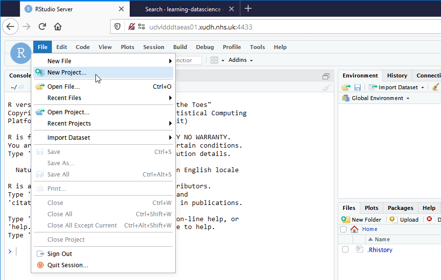
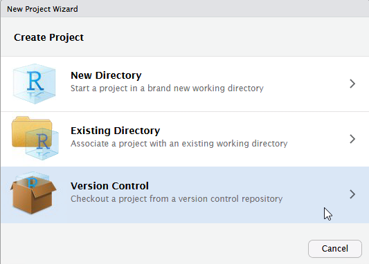
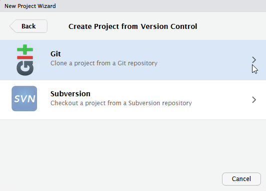

# Working session 2021-11-23

## Objectives

**Overall : revisit how best to work with R & SQL on UCLH systems**

1. using RStudio direct from UCLH Data Science Desktop

2. get most recent ‘learning-datascience’ project from Github into RStudio

3. run same SQL scripts from both R & dbforge

4. brief revision of dplyr (data manipulation) & ggplot2 (plotting)

5. create new RStudio project for own work


### 1 using RStudio direct from UCLH Data Science Desktop

You should all have access to the UCLH Data Science Desktop and should be able to use RStudio directly from there.

The Data Science Desktop is an alternative to your normal UCLH Windows 10 desktop.

Login to a UCLH PC on site or remotely and you should see the option for the Data Science Desktop under the desktops tab as shown in the screenshots below. From a UCLH PC on site you can user the Citrix Workspace app to connect to the Citrix Storefront and access the DSD Desktop.


To start RStudio type 'rst' in the search box at the lower left, an then double click on the RStudio desktop app.


### 2 First time from UCLH PC, set proxies to enable communication with internet

Setting proxies allows RStudio to communicate with the internet from the UCLH Data Science Desktop. You need to create a small text file, paste some commands below into it, save it as a file called .Renviron and then restart RStudio.

Probably the easiest way to do that is to use a function called `edit_r_environ()` within a helper package called `usethis`. You may need to install `usethis` first. So the best thing to do is to copy & paste the 3 lines below into the R console at the lower left:

```
install.packages("usethis")
library(usethis)
usethis::edit_r_environ()
```

This should open a tab called **.Renviron** in the editor at the top left.

Copy & paste the lines below into a space below that tab.

```
# Set-up proxies to allow RStudio & R to talk to internet
# allows e.g. git cloning of new RStudio projects & remotes::install_github
# CRAN package installation seems to work without proxies being set
# this needs to be saved in a file called .Renviron in your home folder
http_proxy=http://www-cache-n.xuclh.nhs.uk:3128/
https_proxy=http://www-cache-n.xuclh.nhs.uk:3128/
HTTP_PROXY=http://www-cache-n.xuclh.nhs.uk:3128/
HTTPS_PROXY=http://www-cache-n.xuclh.nhs.uk:3128/
```

Then save that file by selecting File, Save (or Ctrl S). Close the .Renviron tab.

Restart RStudio.


### 3 get most recent ‘learning-datascience’ project from Github into RStudio

This is a repeat of the process we went through at the start of the R course, but this time we are doing it directly from RStudio in the Data Science Desktop.










Copy into first box **https://github.com/uclh-criu/learning-datascience**


You may need to press 'Browse' to help it find where to save the project.

It may take a while to copy the files. Now you should have a local copy of an RStudio project containing the updated learning resources for the UCLH data science fellows.


### 4 run same SQL scripts from both R & dbforge

In this section we will see one way to run SQL queries from within R. We demonstrate an R method to read a query from an SQL file and then run it to get the data into R.  
This method has the advantage that the same SQL script can be run both in dbForge and R. This gives us the potential to develop and test a query in dbForge and then run it from R.

We will use the same decovid-omop database and similar queries that we experimented with in the SQL course.

In the `learning-datascience` RStudio project, navigate to the folder `database-use` in the files explorer in the lower right panel of RStudio.


#### connecting to a database

You should see a file named `01-connect-to-database-decovid-omop.R`

Click on it and it should open in the top right panel of RStudio.

This contains the code to connect to the database. It includes parts that prompt the user (you) to enter your username and password for the database.

You can run the whole script by clicking the `Source` button at the top right of the left hand panel.

You should see that this creates an object called `ctn` that appears in the Environment tab of the top right hand panel. This object can be used in later code to access the database as we will see next.

#### running SQL queries from R

Open the file `02-run-file-sql-queries.R`.

This contains code to read a query into R from an sql file.

Then it runs that query on the database using the `ctn` object we created above, and saves the resulting data in an R dataframe.


### 5 brief revision of dplyr (data manipulation) & ggplot2 (plotting)

See the file `03-manipulate-plot-query-results.R`


### 6 create new RStudio project for own work

A good way of organising your own R work is by using RStudio projects. An Rstudio project is a folder than can contain both code and data files and has a `.Rproj` file that saves your settings.

To create a new RStudio project, click : 
File, New project, New directory, New project, & type in a name, e.g. my-first-project.

